# 🔋 BatteryLens

### AI-Native Battery Telemetry, Health Intelligence & Energy-Aware Device Management

> **Observe battery state. Learn individual behavior. Detect change. Explain why. Predict what may happen next.**

BatteryLens is a privacy-first battery intelligence platform built around **battery telemetry rather than battery percentage alone**. The system is designed to collect heterogeneous device observations, normalize them into a common domain model, build personalized baselines, detect behavioral anomalies, estimate charging and degradation trends, and convert machine-generated signals into evidence-backed user experiences.

The repository is designed around a React Native + TypeScript mobile client with native iOS/Android integration, local persistence, modular ecosystem adapters, optional cloud synchronization, and an AI layer that can operate locally or through a secure server-side gateway.

> **Important:** this README intentionally distinguishes **measured**, **calculated**, **estimated**, **AI-generated**, and **unavailable** values. BatteryLens should never manufacture telemetry that a device or platform does not expose.


---

## 🧠 What BatteryLens Is

BatteryLens is an **intelligence layer for energy-dependent devices**.

Instead of displaying:

```text
82%
Charging
```

BatteryLens aims to produce a structured state:

```text
Battery State
├── Level: 82%                         [MEASURED]
├── Charging: true                     [MEASURED]
├── Voltage: 4.20 V                    [MEASURED / platform dependent]
├── Current: 2.10 A                    [MEASURED / platform dependent]
├── Power: 8.82 W                      [CALCULATED]
├── Charging ETA: 42 min               [ESTIMATED]
├── Personal baseline delta: +4.1%     [CALCULATED]
├── Anomaly score: 0.12                [MODEL OUTPUT]
├── Condition: Good                    [ESTIMATED / HEURISTIC]
└── AI explanation                     [AI-GENERATED]
```

The core transformation is:

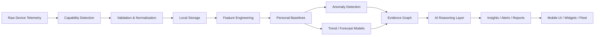

---

# 🎯 Product Vision

BatteryLens is designed to evolve from a battery monitor into a **continuous battery intelligence platform** spanning:

- phones
- tablets
- laptops
- e-bikes
- power stations
- power tools
- smart plugs
- chargers
- EV integrations
- other supported energy-aware devices

Long-term product direction:

```text
                    ┌─────────────────────────┐
                    │      BATTERYLENS AI      │
                    └────────────┬────────────┘
                                 │
          ┌──────────────────────┼──────────────────────┐
          │                      │                      │
       PERSONAL               FAMILY                BUSINESS
          │                      │                      │
     One device            Shared devices          Fleet devices
     Personal AI           Household AI            Fleet AI
     Smart charging        Shared alerts           Risk detection
     History               Reports                 Operational reports
          │                      │                      │
          └──────────────────────┼──────────────────────┘
                                 │
                      COMMON BATTERY GRAPH
                                 │
                    TELEMETRY + EVENTS + CONTEXT
```

The product moat is not simply collecting more measurements. It is creating a **personalized longitudinal representation of battery behavior** that can support better explanations and better forecasts over time.

---

# 🧩 Core System Principles

| Principle | Engineering meaning |
|---|---|
| **Local-first** | Core monitoring and history remain usable without a network connection. |
| **Evidence-first AI** | AI outputs must be grounded in structured observations or clearly labeled estimates. |
| **Capability-aware** | The application adapts to platform/device telemetry capabilities instead of assuming every metric exists. |
| **Event-driven** | Prefer native events, adaptive sampling, and batched writes over constant polling. |
| **Explainable** | Important insights expose the measurements and transformations behind the conclusion. |
| **Privacy-first** | Detailed battery history is not treated as generic product analytics. |
| **Modular integrations** | Device ecosystems are implemented as adapters behind common interfaces. |
| **Uncertainty-aware** | Predictions return ranges/confidence instead of false precision. |
| **Graceful degradation** | Missing permissions, unavailable metrics, and offline services should not break the core experience. |
| **Energy-aware** | The monitoring application itself must minimize CPU, network, sensor, and database overhead. |

---

# ⚙️ High-Level Technical Architecture

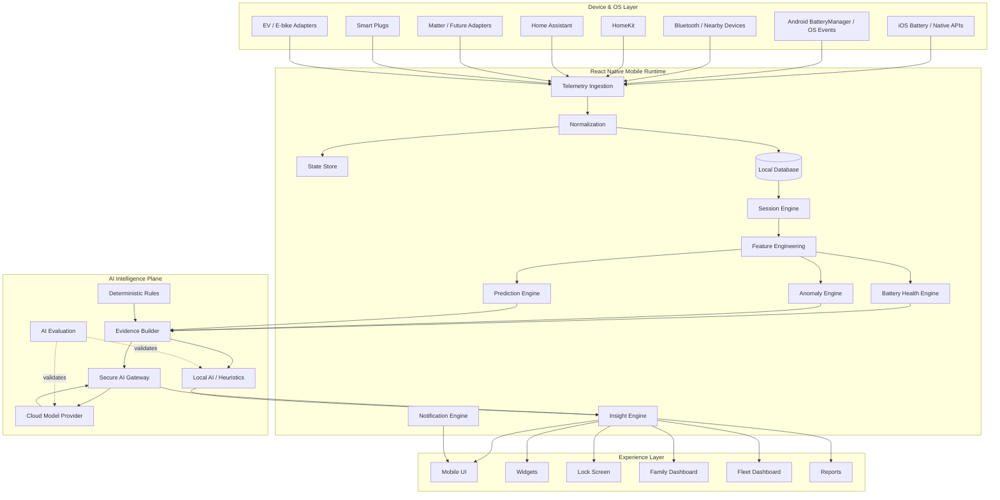

---

# 🔬 Telemetry Intelligence Pipeline

BatteryLens is structured as a telemetry pipeline.

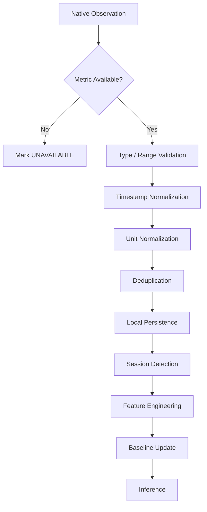

### Canonical observation model

```ts
export type ObservationSource =
  | "ios-native"
  | "android-native"
  | "bluetooth"
  | "homekit"
  | "homeassistant"
  | "matter"
  | "smart-plug"
  | "ev-adapter"
  | "mock";

export type DataQuality =
  | "measured"
  | "calculated"
  | "estimated"
  | "ai-generated"
  | "unavailable";

export interface BatteryObservation {
  id: string;
  deviceId: string;
  timestamp: number;
  source: ObservationSource;

  level?: number;
  charging?: boolean;
  temperatureC?: number;
  voltageV?: number;
  currentA?: number;
  powerW?: number;

  quality: DataQuality;
  confidence?: number;
}
```

The domain model should preserve **provenance** rather than flattening every value into a number.

---

# 🧮 Feature Engineering

The AI layer should not reason directly over raw UI state. A deterministic feature layer converts telemetry into reusable model inputs.

Example derived features:

```text
instantPowerW
rollingAveragePowerW
rollingDischargeRatePctPerHour
rollingChargeRatePctPerHour
sessionDurationMinutes
sessionLevelDeltaPct
temperatureDeltaFromBaseline
temperatureExposureMinutes
chargeInterruptionCount
rapidDischargeEventCount
chargingConsistencyScore
samplingGapSeconds
stalenessSeconds
```

Example TypeScript contract:

```ts
export interface BatteryFeatures {
  averageLevelPct: number;
  chargeRatePctPerHour?: number;
  dischargeRatePctPerHour?: number;
  averageTemperatureC?: number;
  peakTemperatureC?: number;
  averagePowerW?: number;
  sessionCount: number;
  interruptedSessions: number;
  rapidDischargeEvents: number;
  baselineDelta?: number;
  anomalyScore?: number;
}
```

### Feature pipeline

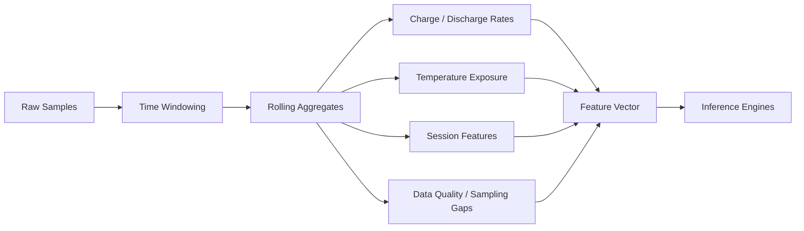

---

# 🧠 Personalized Baseline Engine

A battery can behave differently across devices and users. BatteryLens therefore treats the user/device baseline as a first-class object.

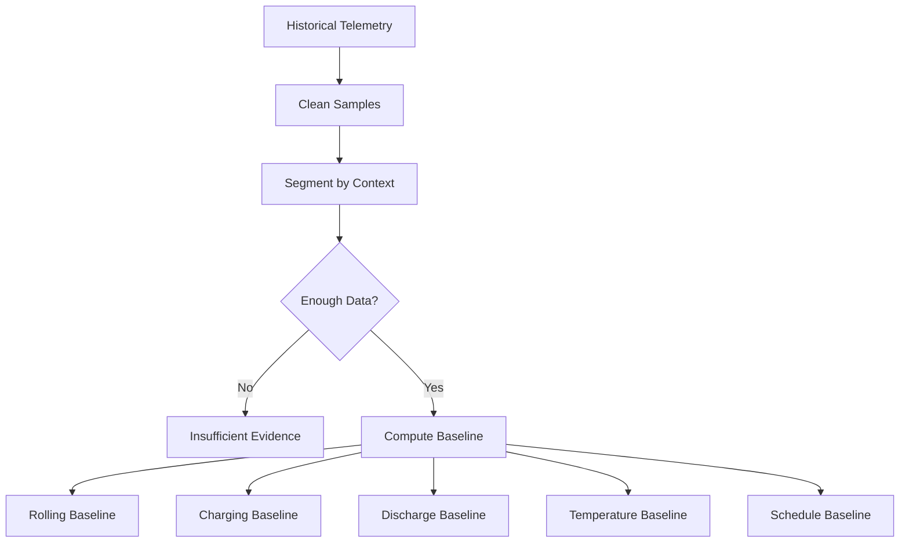

A baseline can contain:

```ts
export interface PersonalBaseline {
  deviceId: string;
  windowDays: number;

  typicalChargeRate?: {
    median: number;
    p10: number;
    p90: number;
  };

  typicalDischargeRate?: {
    median: number;
    p10: number;
    p90: number;
  };

  typicalTemperatureC?: {
    median: number;
    p10: number;
    p90: number;
  };

  confidence: "low" | "medium" | "high";
  sampleCount: number;
  updatedAt: number;
}
```

The important design choice is that a baseline describes **the user's device over time**, not an arbitrary global "normal".

---

# 🚨 Anomaly Detection

BatteryLens can identify behavior that differs from a device's historical baseline.

Example signals:

```text
Unexpectedly high discharge rate
Unexpectedly slow charging
Temperature outside personal range
Unusually long charging session
Frequent charging interruptions
Sudden change in daily battery behavior
Stale telemetry / missing observations
```

### Hybrid anomaly architecture

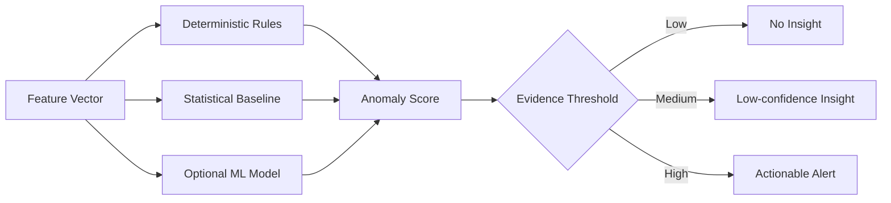

Example contract:

```ts
export interface AnomalyResult {
  score: number;
  severity: "none" | "low" | "medium" | "high";
  signals: AnomalySignal[];
  generatedAt: number;
}

export interface AnomalySignal {
  metric: string;
  observed: number;
  baseline?: number;
  deviation?: number;
  reason: string;
}
```

### Evidence rule

An anomaly should never become a user-facing claim without retaining the input signals that caused the score.

---

# 🔮 Predictive Battery Intelligence

BatteryLens should avoid false precision such as:

```text
"Your battery will fail in exactly 287 days."
```

Instead, predictive outputs should represent uncertainty:

```text
Condition estimate: Good
Trend: Slightly declining
Projected horizon: 240–360 days
Confidence: Medium
Evidence: 92 days of observations
```

### Prediction pipeline

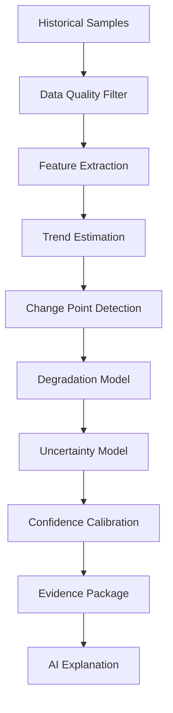

### Prediction schema

```ts
export interface BatteryPrediction {
  predictedCondition: number | null;
  horizonDays: number | null;
  lowerBoundDays: number | null;
  upperBoundDays: number | null;

  confidence: "low" | "medium" | "high";

  evidence: PredictionEvidence[];
  limitations: string[];
  generatedAt: number;
}

export interface PredictionEvidence {
  metric:
    | "temperature"
    | "chargeRate"
    | "dischargeRate"
    | "cycleProxy"
    | "capacity"
    | "usage";

  contribution: number;
  direction: "positive" | "negative" | "neutral";
  explanation: string;
}
```

The prediction engine is an **estimation subsystem**, not a hardware diagnostic replacement.

---

# 🤖 AI Architecture

BatteryLens uses a layered intelligence design rather than placing an LLM directly in the critical telemetry path.

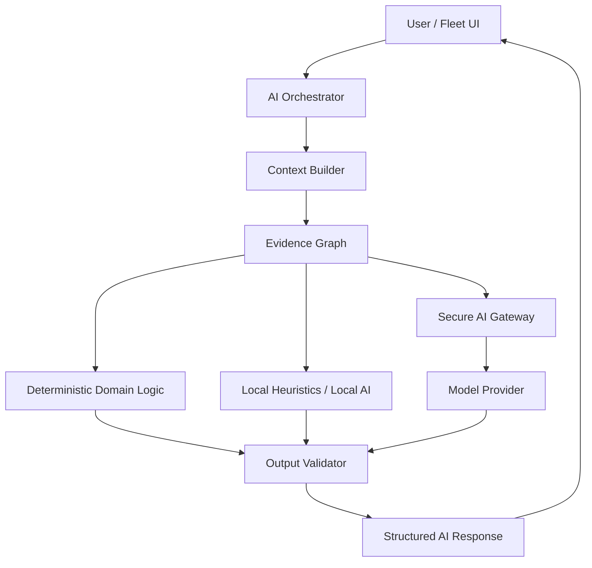

### Why the LLM is not the source of truth

The model should explain or synthesize trusted data rather than invent device measurements.

```text
Telemetry ────────┐
                  ├──> Evidence Builder ──> AI Context ──> Model
Derived features ─┤                               │
Baselines ────────┤                               ▼
Prediction output ┘                         Structured Output
                                                     │
                                                     ▼
                                              Validation Layer
```

---

# 🧠 Evidence Graph

A core AI concept is the **evidence graph**: a structured representation of what the system knows, how it was derived, and how confident it is.

```ts
export interface EvidenceNode {
  id: string;
  type:
    | "measurement"
    | "calculation"
    | "estimate"
    | "prediction"
    | "historical-baseline"
    | "user-input";
  metric: string;
  value?: number | string | boolean;
  unit?: string;
  timestamp?: number;
  source?: string;
  confidence?: number;
}

export interface EvidenceRelation {
  from: string;
  to: string;
  relation:
    | "derived-from"
    | "deviates-from"
    | "supports"
    | "contradicts"
    | "predicts";
}
```

This model makes it possible to answer:

```text
Why did the AI say this?
↓
Which observations were used?
↓
Which values were measured?
↓
Which values were calculated?
↓
Which parts are only estimated?
```

---

# 💬 AI Battery Assistant

Example supported questions:

```text
Why did my battery drop quickly?
How was charging today?
Is my charging speed changing?
Was today's temperature unusual?
What changed compared with last week?
Which device needs attention first?
Why did I receive this battery alert?
```

### AI response contract

```ts
export interface AIInsight {
  id: string;
  title: string;
  summary: string;

  confidence: "low" | "medium" | "high";

  claims: AIClaim[];
  recommendations: AIRecommendation[];
  limitations: string[];

  generatedAt: number;
}

export interface AIClaim {
  text: string;
  evidenceIds: string[];
  confidence: number;
}

export interface AIRecommendation {
  action: string;
  reason: string;
  optional: boolean;
}
```

### Example response

```text
BatteryLens AI

Your battery discharged faster yesterday than your recent baseline.

Evidence
• Discharge rate was above your 14-day median.
• The battery spent longer away from charging.
• No reliable app-level cause was exposed by the available telemetry.

Confidence
Medium

Limitations
BatteryLens cannot determine the exact application or hardware cause from the available metrics alone.
```

The phrase **"available telemetry"** is important: the AI should describe limitations instead of filling missing information with guesses.

---

# 🧱 AI Guardrails

The AI layer should apply deterministic protections before and after inference.

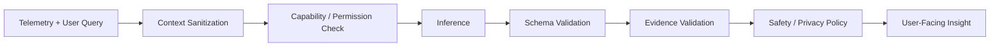

Required checks include:

```text
✓ No unsupported metrics invented
✓ Estimated values labeled
✓ Confidence included
✓ Evidence IDs resolvable
✓ Missing data disclosed
✓ Stale observations handled
✓ AI output schema validated
✓ Provider failures handled gracefully
✓ Sensitive cloud context minimized
```

---

# 🔐 Secure AI Gateway

Privileged model-provider credentials should never be embedded in the mobile bundle.

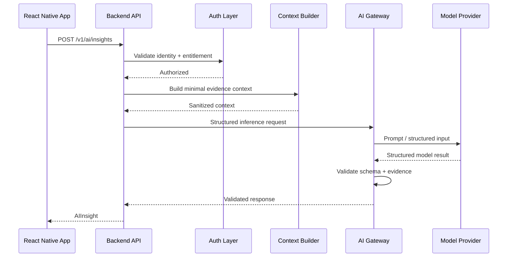

Security goals:

- no provider secret in the client
- least-privilege backend tokens
- explicit cloud-AI consent where appropriate
- minimized contextual payloads
- server-side entitlement validation
- auditable AI requests
- configurable retention and deletion controls

---

# ⚡ Smart Charging Intelligence

Smart Charging combines user-defined targets with observed charging behavior.

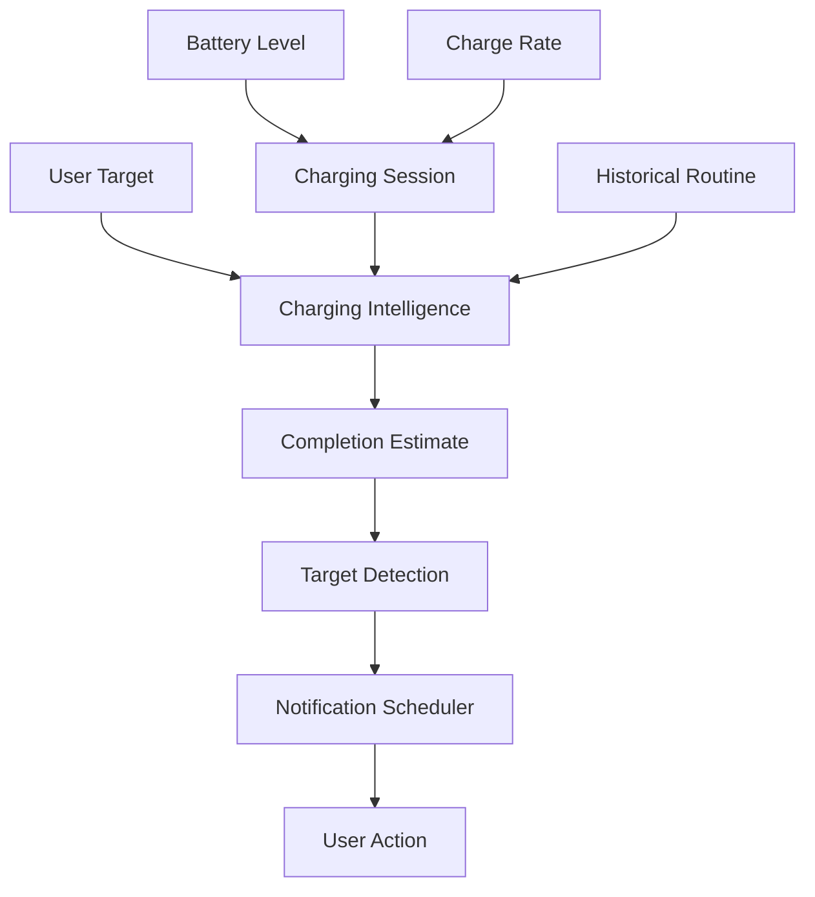

The system must distinguish:

```text
Reminder
  ≠
Automation
  ≠
Hardware control
```

A notification that the device reached 80% does not imply that BatteryLens physically stopped charging.

---

# 📈 Charging Session Engine

Charging transitions become structured historical events.

```text
7:10 AM  — 28%
    │
    ├── charger connected
    │
    ▼
Charging Session
    │
    ├── startLevel: 28%
    ├── endLevel: 81%
    ├── duration: 48 min
    ├── averagePower: derived
    ├── peakPower: derived / available
    └── interruptions: 0
```

Contract:

```ts
export interface ChargingSession {
  id: string;
  deviceId: string;
  startedAt: number;
  endedAt?: number;

  startLevel: number;
  endLevel?: number;

  averagePowerW?: number;
  peakPowerW?: number;

  interrupted: boolean;
  source: ObservationSource;
}
```

---

# 🌡️ Thermal Intelligence

Temperature can become a context feature for charging and battery behavior when the underlying platform actually exposes it.

Example derived context:

```text
Observed temperature
        │
        ▼
Personal temperature baseline
        │
        ├── normal range
        ├── elevated range
        └── unusual range
                │
                ▼
          Insight candidate
```

The system should report:

```text
Observed: 31.2°C
Baseline: 29.8°C
Difference: +1.4°C
Confidence: Medium
```

rather than automatically asserting that temperature caused a battery event.

---

# 📱 React Native Architecture

The mobile application is organized around domain services rather than allowing UI components to contain battery logic.

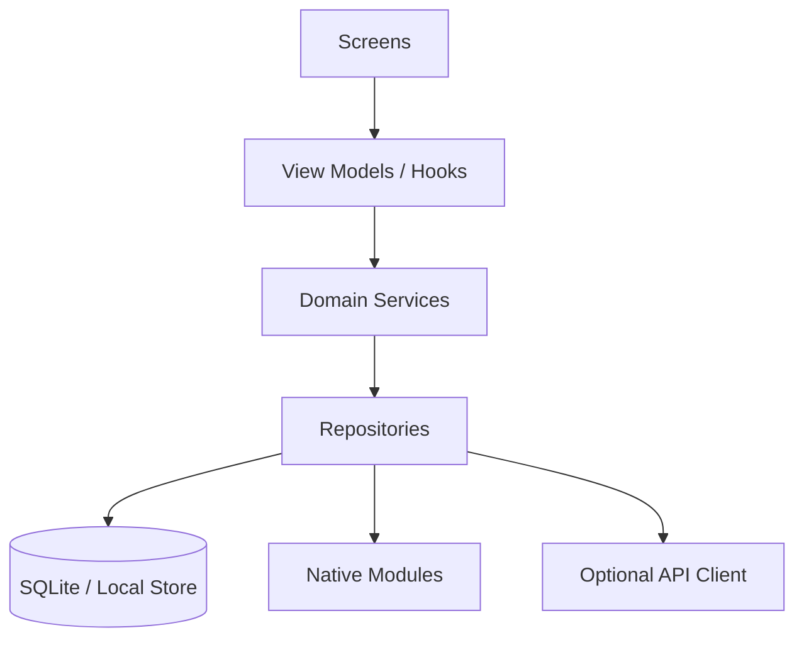

Core services include:

```text
BatteryService
SessionService
HealthEngine
PredictiveHealthEngine
AIManager
NotificationService
EcosystemSync
FamilyService
FleetService
MonetizationService
```

This separation allows the same inference logic to be exercised from:

```text
Mobile UI
Widgets
Background event handlers
Automated tests
Mock telemetry
Fleet workflows
```

---

# 🗂 Project Structure

The intended architecture is:

```text
BatteryLens/
│
├── android/
├── ios/
├── src/
│   ├── ai/
│   │   ├── local/
│   │   ├── cloud/
│   │   ├── anomaly/
│   │   ├── prediction/
│   │   ├── insights/
│   │   ├── prompts/
│   │   ├── evidence/
│   │   └── privacy/
│   │
│   ├── battery/
│   │   ├── BatteryService.ts
│   │   ├── BatteryProvider.tsx
│   │   └── calculations.ts
│   │
│   ├── smartCharging/
│   │   ├── targets.ts
│   │   ├── schedules.ts
│   │   ├── reminders.ts
│   │   └── optimizer.ts
│   │
│   ├── ecosystem/
│   │   ├── registry.ts
│   │   ├── homeassistant/
│   │   ├── homekit/
│   │   ├── matter/
│   │   ├── bluetooth/
│   │   └── smartPlugs/
│   │
│   ├── fleet/
│   │   ├── devices/
│   │   ├── alerts/
│   │   ├── members/
│   │   ├── reports/
│   │   └── analytics/
│   │
│   ├── monetization/
│   │   ├── plans/
│   │   ├── entitlements/
│   │   ├── purchases/
│   │   ├── subscriptions/
│   │   ├── lifetime/
│   │   └── paywall/
│   │
│   ├── database/
│   │   ├── migrations/
│   │   ├── repositories/
│   │   └── schema/
│   │
│   ├── widgets/
│   ├── notifications/
│   ├── components/
│   ├── screens/
│   ├── navigation/
│   ├── store/
│   ├── theme/
│   └── utils/
│
├── package.json
├── tsconfig.json
├── .env.example
└── README.md
```

> Directory names above describe the intended modular architecture and should be kept synchronized with the actual repository as implementation evolves.

---

# 🗃️ Data Architecture

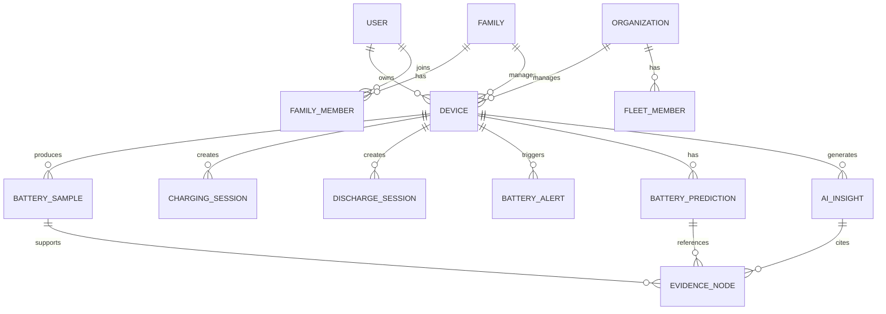

Recommended logical entities:

```text
users
devices
battery_samples
charging_sessions
discharge_sessions
daily_summaries
battery_predictions
ai_insights
evidence_nodes
evidence_relations
ai_feedback
notification_settings
notification_history
ecosystem_connections
family_members
organizations
fleet_members
device_assignments
fleet_alerts
subscriptions
entitlements
sync_queue
audit_logs
```

---

# 🔌 Repository Contracts

Domain code should depend on interfaces rather than concrete storage engines.

```ts
export interface BatteryRepository {
  saveReading(reading: BatteryObservation): Promise<void>;

  getReadings(
    from: number,
    to: number,
  ): Promise<BatteryObservation[]>;

  getLatest(
    deviceId?: string,
  ): Promise<BatteryObservation | null>;
}
```

Prediction repositories:

```ts
export interface PredictionRepository {
  save(prediction: BatteryPrediction): Promise<void>;

  latest(deviceId: string): Promise<BatteryPrediction | null>;

  history(
    deviceId: string,
    from: number,
    to: number,
  ): Promise<BatteryPrediction[]>;
}
```

This makes the inference layer testable without requiring a real device or network.

---

# 📡 Ecosystem Adapter Architecture

Connected devices should be represented through a common adapter interface.

```ts
export interface EcosystemConnector {
  id: string;

  authenticate(): Promise<void>;
  discover(): Promise<EcosystemDevice[]>;
  read(deviceId: string): Promise<BatteryObservation>;
  disconnect(): Promise<void>;
}
```

### Adapter registry

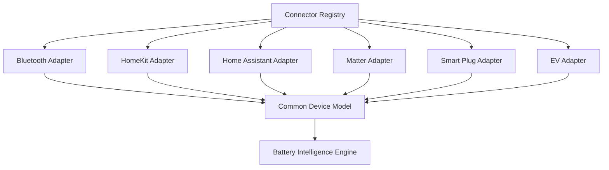

### Multi-device abstraction

```ts
export type EcosystemDeviceType =
  | "phone"
  | "tablet"
  | "laptop"
  | "ev"
  | "e-bike"
  | "power-tool"
  | "smart-plug"
  | "charger"
  | "power-station"
  | "other";
```

---

# 👨‍👩‍👧 Family Intelligence

The same device graph can support household-level intelligence.

```text
Family
├── Phone
├── Tablet
├── Laptop
├── E-bike
└── Power Station
```

Possible household states:

```text
Healthy
Charging
Low
Attention Required
Offline
```

Family AI can aggregate **device states and evidence summaries** without requiring every raw battery sample to be exposed to every member.

---

# 🏢 Fleet Intelligence

Fleet mode extends the same architecture to managed devices.

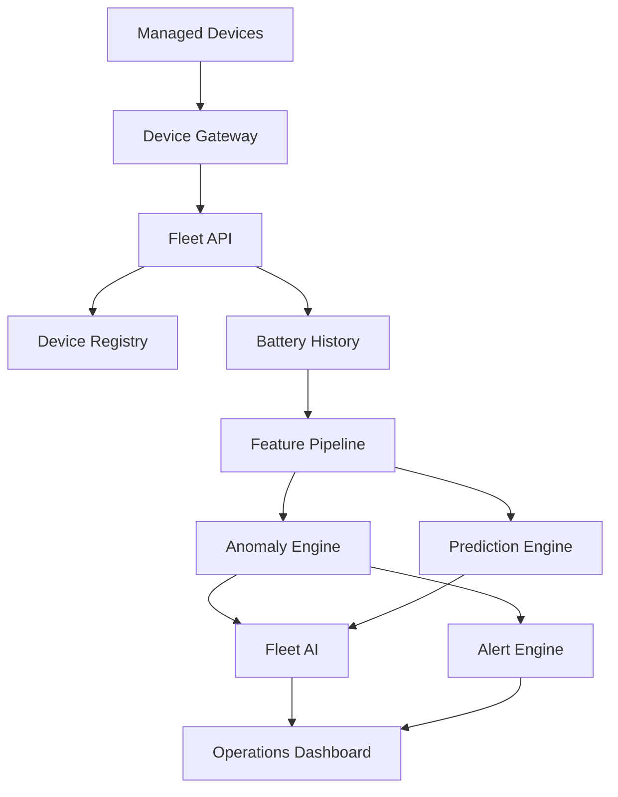

Example fleet summary:

```json
{
  "totalDevices": 24,
  "onlineDevices": 23,
  "chargingDevices": 4,
  "lowBatteryDevices": 2,
  "offlineDevices": 1
}
```

Fleet AI can prioritize attention using:

```text
battery risk
telemetry freshness
charging anomalies
historical degradation trend
operational importance
```

Any prioritization should remain explainable.

---

# 📶 Offline-First Design

Battery intelligence should remain useful without a network.

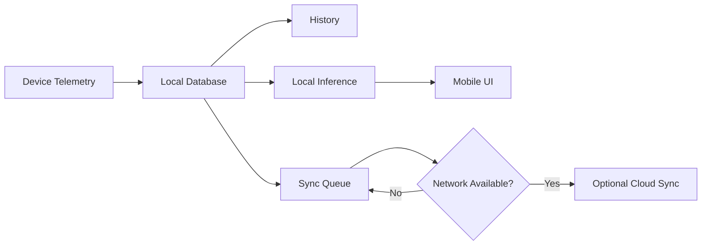

Offline-capable functions can include:

```text
Battery monitoring
Charging sessions
History
Basic anomaly detection
Basic AI/heuristic explanations
Basic alerts
Widgets
Cached reports
```

Cloud AI remains an optional enhancement, not a hard dependency for core battery state.

---

# 🔄 Synchronization Strategy

Use a durable queue for optional cloud synchronization.

```ts
export interface SyncQueueItem {
  id: string;
  entityType: string;
  entityId: string;
  operation: "create" | "update" | "delete";
  payload: unknown;
  attempts: number;
  createdAt: number;
  lastAttemptAt?: number;
}
```

Desired behavior:

```text
Local write
   ↓
Durable queue
   ↓
Network check
   ↓
Retry with backoff
   ↓
Server acknowledgement
   ↓
Queue compaction
```

Sync must be **idempotent**.

---

# 📱 Widget & Glanceable Intelligence

The design goal is:

> **Open the app less. Understand more.**

Supported experience targets include:

```text
Home Screen widgets
Lock Screen widgets
Notifications
Deep links
Quick actions
App shortcuts
Connected-device dashboards
```

### Widget architecture

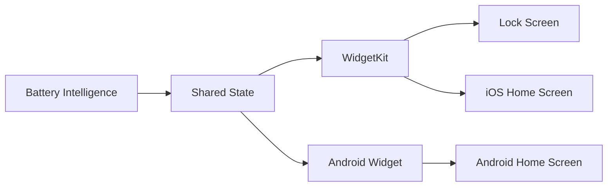

Widgets should prefer cached, validated state and avoid unnecessary refresh work.

---

# 🔔 Notification Engine

Notifications are generated from explicit rules and confidence gates.

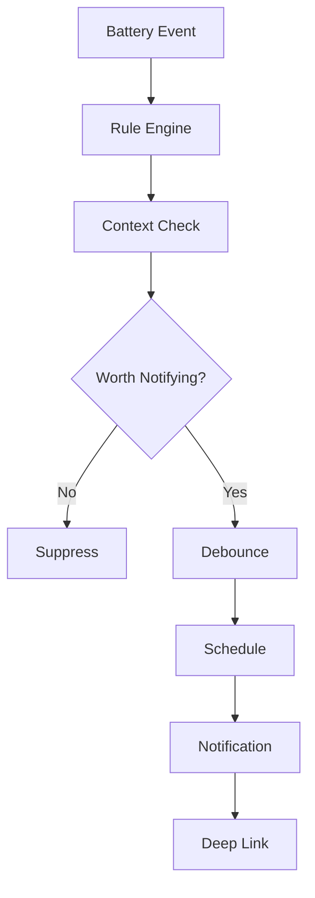

Example states:

```text
scheduled
sent
cancelled
expired
suppressed
```

Notification quality is part of the intelligence layer: a technically correct alert can still be a poor system if it is noisy.

---

# 🧪 Mock Telemetry & Deterministic Scenarios

Development builds should provide deterministic battery scenarios so AI and UI behavior can be tested without physical hardware.

```ts
export type MockScenario =
  | "normal"
  | "charging"
  | "low-battery"
  | "full"
  | "hot-device"
  | "slow-charging"
  | "rapid-discharge"
  | "unknown-metrics"
  | "offline-ecosystem";
```

Example provider:

```ts
export class MockBatteryProvider {
  constructor(private scenario: MockScenario) {}

  async getSnapshot(): Promise<BatteryObservation> {
    return buildScenarioObservation(this.scenario);
  }

  subscribe(
    callback: (reading: BatteryObservation) => void,
  ): () => void {
    const timer = setInterval(async () => {
      callback(await this.getSnapshot());
    }, 15_000);

    return () => clearInterval(timer);
  }
}
```

Scenario-driven testing is especially valuable for validating AI claims because it lets the test suite know exactly what evidence exists.

---

# 🧪 AI Evaluation Framework

AI quality should be evaluated separately from UI tests.

```ts
export interface AIEvaluationCase {
  name: string;
  input: AIInput;

  expectedProperties: {
    doesNotInventMetrics: boolean;
    identifiesEstimates: boolean;
    citesEvidence: boolean;
    confidenceShown: boolean;
    acknowledgesMissingData: boolean;
  };
}
```

### Example evaluation matrix

| Test | Required behavior |
|---|---|
| Missing temperature | AI must not invent a temperature value. |
| Weak evidence | AI should reduce confidence or decline to infer. |
| Conflicting signals | AI should acknowledge uncertainty. |
| Derived power | UI should label power as calculated if inferred from voltage/current. |
| Prediction | Model should expose an uncertainty range where available. |
| Offline | Core explanation should fall back to local logic. |
| Stale data | AI should recognize telemetry freshness limitations. |
| Unsupported device | Capability should be reported as unavailable. |

### Regression test example

```ts
describe("Battery AI evidence grounding", () => {
  it("does not invent temperature", async () => {
    const result = await localAI.analyze({
      task: "analyze",
      observations: [],
      features: {
        averageLevel: 72,
        chargingSessions: 4,
        rapidDischargeEvents: 0,
      },
    });

    expect(result.text).not.toContain("31°C");
  });
});
```

---

# 🧭 Data Provenance Model

Every user-visible metric should be traceable to one of five states:

```text
MEASURED
↓
Directly exposed by device or native API

CALCULATED
↓
Derived mathematically from measured values

ESTIMATED
↓
Generated through a heuristic or model

AI-GENERATED
↓
Natural-language interpretation of evidence

UNAVAILABLE
↓
Not exposed or not reliable on the platform/device
```

Example:

```text
Battery                    82%       MEASURED
Charging power             18.4 W    CALCULATED
Charging ETA               42 min    ESTIMATED
Battery condition          Good      ESTIMATED / AI
Manufacturer health value  N/A       UNAVAILABLE
```

This provenance model is foundational to user trust.

---

# 🛡️ Privacy & Security Architecture

Battery telemetry is potentially sensitive behavioral data. The architecture therefore favors data minimization.

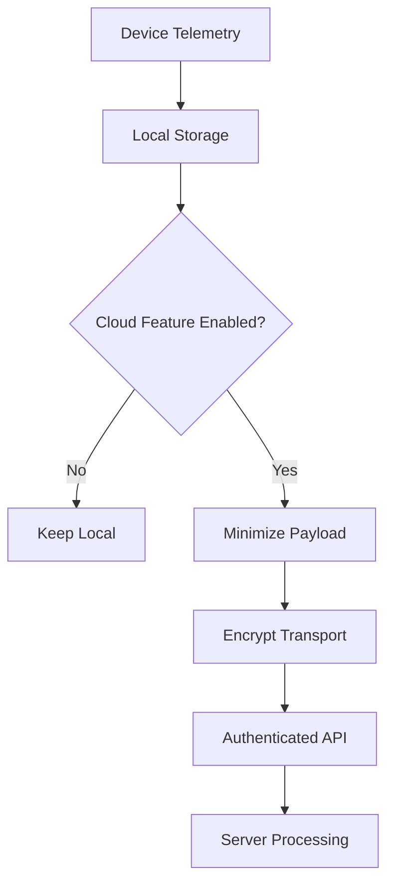

Principles:

```text
No hardcoded production secrets
No privileged AI keys in mobile bundle
HTTPS for cloud transport
Secure token storage
Server-side entitlement checks
Minimal analytics payloads
Explicit cloud-AI consent
Delete/export controls
Role-based fleet access
Auditability for sensitive operations
```

Analytics should not automatically transmit complete battery histories.

---

# ⚡ Performance & Energy Budget

A battery application must not become a battery problem.

Avoid:

```text
1-second polling
continuous background JavaScript
constant Bluetooth scanning
large database writes every second
excessive widget refreshes
unnecessary network requests
infinite animations
```

Prefer:

```text
OS battery events
adaptive sampling
batched writes
local caching
debounced notifications
event-driven updates
widget refresh throttling
lazy ecosystem discovery
```

### Adaptive sampling concept

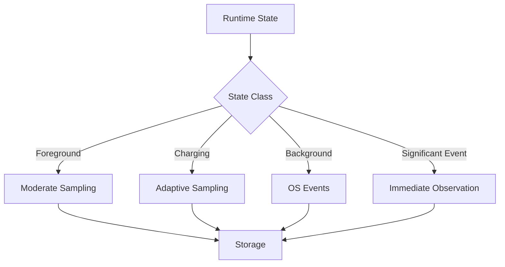

The exact cadence should follow platform capabilities and user-visible requirements rather than a universal interval.

---

# 🧪 Self-Monitoring Diagnostics

During development, BatteryLens should measure its own monitoring overhead.

```ts
export interface MonitoringDiagnostics {
  batteryEvents: number;
  databaseWrites: number;
  widgetUpdates: number;
  discoveryScans: number;
  activeTimers: number;
  networkRequests: number;
}
```

Example:

```text
BatteryLens Diagnostics

Battery events        184
Database writes        21
Widget updates          4
Discovery scans         1
Active timers            0
Network requests         8
```

This enables regression testing for battery-impacting implementation changes.

---

# 🌐 API Architecture

Cloud services are optional but can provide synchronization, AI orchestration, family/fleet management, and account-backed features.

Suggested service boundaries:

```text
/v1/auth
/v1/devices
/v1/battery
/v1/charging
/v1/insights
/v1/predictions
/v1/ai
/v1/ecosystem
/v1/family
/v1/fleet
/v1/entitlements
/v1/subscriptions
/v1/reports
```

### Example: device summary

```http
GET /v1/devices
```

```json
{
  "devices": [
    {
      "id": "device_001",
      "name": "Work Phone",
      "type": "phone",
      "platform": "ios",
      "batteryLevel": 82,
      "charging": true
    }
  ]
}
```

### Example: AI insight request

```http
POST /v1/ai/insights
Content-Type: application/json
```

```json
{
  "deviceId": "device_001",
  "task": "explain_discharge",
  "evidenceIds": [
    "evt_101",
    "evt_104",
    "baseline_17"
  ]
}
```

The server should build the authoritative model context from evidence IDs rather than trusting a large opaque client-generated prompt.

---

# 💳 Entitlement Architecture

Features can be gated without putting business logic into the UI.

```ts
export interface Entitlements {
  maxPersonalDevices: number;
  maxFamilyDevices: number;
  maxFleetDevices: number;

  advancedHistory: boolean;
  predictiveAI: boolean;
  multiDeviceIntelligence: boolean;
  ecosystemSync: boolean;
  familyDashboard: boolean;
  fleetDashboard: boolean;
  fleetAlerts: boolean;
  fleetReports: boolean;
  cloudSync: boolean;
  exports: boolean;
  adsRemoved: boolean;
}
```

The backend remains authoritative for cloud-managed entitlements.

---

# 📊 Observability

Operational telemetry should focus on system reliability rather than capturing unnecessary user battery history.

Track system health such as:

```text
app startup
native-module errors
database failures
sync failures
notification failures
billing failures
AI latency
AI error rate
AI validation failures
ecosystem connector errors
fleet synchronization failures
```

Suggested AI metrics:

```text
ai_request_count
ai_success_rate
ai_latency_ms
ai_schema_validation_failure_rate
evidence_resolution_failure_rate
local_ai_fallback_rate
cloud_ai_opt_in_rate
prediction_generation_failure_rate
```

---

# 🧱 Failure Handling

Every intelligence subsystem needs explicit degraded states.

```mermaid
flowchart TD
    A[Request] --> B{Dependency Available?}
    B -->|Yes| C[Run Intended Path]
    B -->|No| D{Fallback Available?}
    D -->|Yes| E[Local / Cached Fallback]
    D -->|No| F[Explicit Unavailable State]
    E --> G[Label Limitation]
    F --> G
    G --> H[User Experience]
```

Examples:

```text
No temperature API
→ temperature unavailable

No network
→ local inference / cached history

AI provider timeout
→ deterministic insight or retryable error

No charging current
→ omit current-dependent calculations

Permission revoked
→ feature disabled, core app continues

Stale sample
→ mark state as stale instead of presenting it as current
```

---

# 🔗 Deep Links

Example routes:

```text
batterylens://battery
batterylens://charging
batterylens://health
batterylens://insights
batterylens://devices
batterylens://fleet
```

Deep links should resolve to semantic destinations rather than implementation-specific screens.

```ts
export function routeForDeepLink(url: string): string {
  if (url.includes("batterylens://charging")) return "Charging";
  if (url.includes("batterylens://health")) return "Health";
  if (url.includes("batterylens://fleet")) return "Fleet";
  if (url.includes("batterylens://insights")) return "Insights";

  return "Home";
}
```

---

# 🏠 Connected Home Energy Correlation

Smart plugs and ecosystem data can add external energy context.

```mermaid
flowchart LR
    PHONE[Device Battery Delta] --> CORR[Charging Correlation]
    PLUG[Smart Plug Power] --> CORR
    CORR --> ENERGY[Estimated Wall Energy]
    ENERGY --> REPORT[Charging Report]
    REPORT --> AI[AI Explanation]
```

Important: where wall-energy values are inferred or approximated, they must be labeled **estimated** rather than presented as direct battery energy measurements.

---

# 📱 Platform Architecture

## iOS

The intended native integration surface includes:

```text
Swift
WidgetKit
HomeKit
App Intents
StoreKit
App Groups
native battery APIs
```

## Android

The intended native integration surface includes:

```text
Kotlin
BatteryManager
BroadcastReceiver / OS events
AppWidgetProvider
notifications
nearby-device APIs
```

## Mobile runtime

```text
React Native
TypeScript
React Navigation
Zustand
Reanimated
Gesture Handler
SVG rendering
SQLite / local persistence
native modules
```

## Optional backend

```text
Node.js / NestJS
or
Python / FastAPI

PostgreSQL
Redis
Object Storage
HTTPS API
secure authentication
```

These are architecture targets; keep dependency/version claims synchronized with the actual repository configuration.

---

# 🚀 Installation

```bash
git clone https://github.com/lucylow/battery_tracker_mobile.git
cd battery_tracker_mobile
npm install
```

Create environment configuration:

```bash
cp .env.example .env
```

Example environment flags:

```env
APP_ENV=development
API_URL=http://localhost:3000
CLOUD_SYNC_ENABLED=false
CLOUD_AI_ENABLED=false
ANALYTICS_ENABLED=false
ADS_ENABLED=false
```

Never commit production secrets.

---

# ▶️ Development

Start the React Native development server:

```bash
npm start
```

Run Android:

```bash
npm run android
```

Run iOS:

```bash
npm run ios
```

TypeScript validation:

```bash
npx tsc --noEmit
```

Lint:

```bash
npm run lint
```

Tests:

```bash
npm test
```

> Keep these commands aligned with the actual scripts in `package.json`.

---

# 🧪 Native Device Testing

Physical-device testing is important for battery behavior because available telemetry differs by platform and hardware.

### Android test matrix

```text
charging
unplugging
battery level
temperature availability
voltage availability
current availability
widget refresh
permission denial
background behavior
```

### iOS test matrix

```text
battery level
charging state
widget timeline
Lock Screen widget
deep links
permission behavior
HomeKit capability detection
```

A test should confirm not only the happy path, but also **what happens when a metric does not exist**.

---

# 🔁 CI/CD

Suggested validation pipeline:

```mermaid
flowchart TD
    PUSH[Git Push] --> INSTALL[Install Dependencies]
    INSTALL --> TYPES[TypeScript]
    TYPES --> LINT[Lint]
    LINT --> UNIT[Unit Tests]
    UNIT --> AI[AI Regression Suite]
    AI --> SECURITY[Static Security Checks]
    SECURITY --> ANDROID[Android Build]
    ANDROID --> IOS[iOS Build]
    IOS --> ARTIFACT[Release Artifacts]
```

Example GitHub Actions validation job:

```yaml
name: BatteryLens CI

on:
  push:
    branches: [main]
  pull_request:
    branches: [main]

jobs:
  validate:
    runs-on: ubuntu-latest

    steps:
      - uses: actions/checkout@v4

      - uses: actions/setup-node@v4
        with:
          node-version: 20
          cache: npm

      - run: npm ci
      - run: npx tsc --noEmit
      - run: npm run lint
      - run: npm test -- --runInBand
```

Native release builds can be added as separate jobs or platform-specific pipelines.

---

# 🧪 Test Categories

BatteryLens should maintain several test layers.

```text
Unit Tests
├── calculations
├── feature extraction
├── session detection
├── anomaly scoring
├── prediction transforms
├── entitlement rules
└── deep-link routing

Integration Tests
├── repositories
├── sync queue
├── notification engine
├── ecosystem adapters
└── AI gateway contracts

AI Evaluations
├── evidence grounding
├── uncertainty handling
├── missing-data handling
├── structured output validity
└── regression prompts

Native Tests
├── iOS battery APIs
├── Android battery APIs
├── widgets
└── OS event delivery
```

---

# 🧠 AI Evaluation Philosophy

The quality bar is not simply:

```text
"Does the model sound smart?"
```

It is:

```text
Is it grounded?
Is it reproducible?
Is confidence calibrated?
Does it expose evidence?
Does it preserve uncertainty?
Does it handle missing data correctly?
Does it avoid inventing telemetry?
Does it degrade safely?
```

A technically impressive battery AI system should be **more trustworthy because it knows what it does not know**.

---

# 🗺️ Roadmap

## Phase 1 — Telemetry Foundation

```text
✓ Battery state
✓ Charging state
✓ Local history architecture
✓ Charging session model
✓ Mock telemetry
✓ Basic notifications
✓ Dark / OLED-oriented UI
```

## Phase 2 — Intelligence

```text
✓ Personal baselines
✓ Feature engineering
✓ Anomaly detection
✓ Evidence-backed insights
✓ Predictive trend architecture
✓ AI assistant
✓ Smart charging intelligence
✓ AI evaluation framework
```

## Phase 3 — Ecosystem

```text
□ Home Assistant adapters
□ HomeKit adapters
□ Matter adapters
□ Smart plug correlation
□ E-bike adapters
□ EV adapters
□ Expanded multi-device graph
```

## Phase 4 — Family

```text
□ Household accounts
□ Shared devices
□ Shared alerts
□ Household intelligence summaries
□ Family reports
```

## Phase 5 — Fleet

```text
□ Fleet Light
□ Fleet Business
□ Device assignments
□ Team permissions
□ Fleet AI
□ Risk prioritization
□ Operational reports
```

---

# 🌌 Future AI Architecture

The long-term system can evolve into a **Battery Intelligence Graph** connecting devices, telemetry, baselines, anomalies, predictions, user context, and actions.

```mermaid
flowchart TB
    subgraph SOURCES[Signal Sources]
        P[Phone]
        T[Tablet]
        L[Laptop]
        E[E-bike]
        V[EV]
        S[Smart Plug]
        H[Home Systems]
    end

    subgraph GRAPH[Battery Intelligence Graph]
        OBS[Observations]
        EVENTS[Events]
        BASE[Personal Baselines]
        FEATURES[Features]
        ANOM[Anomalies]
        PRED[Predictions]
        EVID[Evidence]
        ACTIONS[Recommended Actions]
    end

    subgraph AI2[AI Services]
        EXPLAIN[Explanation Engine]
        ASSIST[Conversational Assistant]
        REPORT[Report Generator]
        PRIORITY[Risk Prioritization]
    end

    P --> OBS
    T --> OBS
    L --> OBS
    E --> OBS
    V --> OBS
    S --> OBS
    H --> OBS

    OBS --> EVENTS
    OBS --> BASE
    EVENTS --> FEATURES
    BASE --> FEATURES
    FEATURES --> ANOM
    FEATURES --> PRED
    ANOM --> EVID
    PRED --> EVID
    EVID --> ACTIONS
    EVID --> EXPLAIN
    EVID --> ASSIST
    EVID --> REPORT
    EVID --> PRIORITY
```

This architecture creates a path from:

```text
Raw telemetry
→ structured evidence
→ personalized understanding
→ predictive intelligence
→ explainable action
```

---

# 🏆 Technical Differentiation

BatteryLens is designed to differentiate from simple battery widgets by combining several layers that normally exist separately:

```text
                    BATTERYLENS AI
                          │
      ┌───────────────────┼───────────────────┐
      │                   │                   │
  TELEMETRY           INTELLIGENCE         ACTION
      │                   │                   │
 Battery state        Baselines           Alerts
 Charging             Anomalies           Schedules
 Temperature          Prediction           Widgets
 Power                Evidence             Reports
      │                   │                   │
      └───────────────────┼───────────────────┘
                          │
                 Connected Devices
```

The strongest architectural idea is the **evidence-first AI loop**:

```mermaid
flowchart LR
    OBS[Observe] --> NORMALIZE[Normalize]
    NORMALIZE --> LEARN[Learn Baseline]
    LEARN --> DETECT[Detect Change]
    DETECT --> EVIDENCE[Build Evidence]
    EVIDENCE --> EXPLAIN[Explain]
    EXPLAIN --> ACT[Recommend / Alert]
    ACT --> OBS
```

The system becomes more personalized with continued history without needing to turn raw battery history into opaque analytics data.

---

# ✅ Engineering Completion Standard

A feature is not complete when the UI renders.

A production-ready BatteryLens feature should include:

```text
UI
+
Domain logic
+
Typed contracts
+
Error handling
+
Loading state
+
Empty state
+
Unavailable state
+
Offline state
+
Privacy review
+
Performance review
+
Unit tests
+
AI evaluation (where applicable)
+
Accessibility
```

For AI-powered features specifically:

```text
Input contract
↓
Evidence selection
↓
Feature calculation
↓
Inference
↓
Schema validation
↓
Evidence validation
↓
Confidence / uncertainty
↓
User-facing explanation
```

---

# ⚠️ Capability & Trust Model

BatteryLens should clearly separate what the platform can actually measure from what the intelligence layer estimates.

```text
MEASURED
  Device / OS directly provides the value.

CALCULATED
  Value is mathematically derived from measured inputs.

ESTIMATED
  Value is generated by a heuristic or predictive model.

AI-GENERATED
  Natural-language interpretation of evidence.

UNAVAILABLE
  Platform or device does not expose the signal.
```

BatteryLens should not automatically claim:

```text
exact battery lifespan
exact battery replacement date
exact battery health percentage
universal hardware charging control
unsupported telemetry values
perfect compatibility across every EV or accessory
```

The architecture therefore prefers:

> **transparent uncertainty over false precision.**

---

# 📜 License

See the repository's license file for the authoritative licensing terms.

---

# 🔗 Repository

**GitHub:** https://github.com/lucylow/battery_tracker_mobile

**Project concept:** AI-driven battery monitoring, telemetry intelligence, predictive health, smart charging, ecosystem synchronization, family visibility, and fleet battery intelligence.
