# 🔋 BatteryLens

### Personal Battery Intelligence for Phones, Laptops, E-Bikes, EVs & Connected Devices 

> **Understand your battery. Anticipate patterns. Act before downtime.**

BatteryLens is a privacy-first battery intelligence platform that transforms raw battery and charging telemetry into understandable insights, predictive trends, smart charging reminders, connected-device dashboards, and fleet-level battery visibility.

Instead of functioning as another simple battery-percentage application, BatteryLens is designed as an intelligent layer between the devices people depend on and the decisions they need to make.

```text
┌───────────────────────────────────────────────────────────────┐
│                         BATTERYLENS                           │
├───────────────────────────────────────────────────────────────┤
│                                                               │
│  MONITOR → UNDERSTAND → PREDICT → REMIND → MANAGE → OPTIMIZE │
│                                                               │
│  Battery        AI          Trends      Alerts     Fleet      │
│  Charging       Insights    Forecasts   Schedules  Ecosystem  │
│  Temperature    Explain     Patterns    Smart      Devices   │
│  Power          Evidence    Risk        Charging  Reports    │
│                                                               │
└───────────────────────────────────────────────────────────────┘
```

---

# 📖 Table of Contents

* [Overview](#-overview)
* [Why BatteryLens](#-why-batterylens)
* [Product Vision](#-product-vision)
* [Core Features](#-core-features)
* [Architecture](#-architecture)
* [Technical Architecture Diagram](#-technical-architecture-diagram)
* [React Native Architecture](#-react-native-architecture)
* [Battery Intelligence Engine](#-battery-intelligence-engine)
* [Predictive Health AI](#-predictive-health-ai)
* [AI Assistant](#-ai-assistant)
* [Smart Charging](#-smart-charging)
* [Widget-First UX](#-widget-first-ux)
* [Zero-Configuration Setup](#-zero-configuration-setup)
* [Smart Ecosystem Sync](#-smart-ecosystem-sync)
* [Family & Fleet Tracking](#-family--fleet-tracking)
* [Privacy Architecture](#-privacy-architecture)
* [Monetization](#-monetization)
* [Data Model](#-data-model)
* [API Architecture](#-api-architecture)
* [Project Structure](#-project-structure)
* [Installation](#-installation)
* [Environment Configuration](#-environment-configuration)
* [Android Development](#-android-development)
* [iOS Development](#-ios-development)
* [Testing](#-testing)
* [CI/CD](#-cicd)
* [Security](#-security)
* [Performance](#-performance)
* [Observability](#-observability)
* [Roadmap](#-roadmap)
* [Contributing](#-contributing)
* [License](#-license)

---

# 🚀 Overview

BatteryLens is built around a simple idea:

> **Battery data becomes much more valuable when it is contextualized over time.**

A normal operating-system battery screen might show:

```text
82%
Charging
```

BatteryLens turns this into:

```text
82%
Charging

18.4 W estimated charging power

42 min estimated to target

Your charging speed is close to
your recent personal baseline.

Temperature:
31°C

Today's charging:
2 sessions

Weekly charging:
8 sessions
```

And eventually:

```text
BatteryLens AI

Your recent charging pattern is
consistent with your historical baseline.

No unusual temperature trend
was detected in the available data.

Confidence:
Medium
```

The platform is designed to work across multiple levels:

```text
                         BatteryLens
                              │
       ┌──────────────────────┼─────────────────────┐
       │                      │                     │
    Personal               Family                Business
       │                      │                     │
   One device            Shared devices        Fleet devices
   Battery AI            Shared alerts         Fleet alerts
   Smart charging        Household view        Fleet reports
   Widgets               Permissions            AI summaries
       │                      │                     │
       └──────────────────────┼─────────────────────┘
                              │
                       Connected Ecosystem
                              │
                 ┌────────────┼────────────┐
                 │            │            │
             Smart Plugs  Home Assistant  HomeKit
                 │            │            │
                 └────────────┼────────────┘
                              │
                             AI
```

---

# 💡 Why BatteryLens

Battery monitoring applications frequently stop at:

* battery percentage
* charging state
* temperature
* voltage
* basic statistics

BatteryLens attempts to solve a larger problem:

### 1. Users need context

A single battery percentage says little about:

* historical charging patterns
* charging consistency
* unusual heat exposure
* changing discharge behavior
* device-to-device differences

### 2. Users need action

BatteryLens turns measurements into:

```text
Measurement
↓
Interpretation
↓
Recommendation
↓
Optional Reminder
```

### 3. Families need visibility

A household may contain:

```text
Phone
Tablet
Laptop
E-bike
Power station
```

BatteryLens can consolidate supported devices into one view.

### 4. Businesses need operational awareness

Small teams may manage:

```text
delivery phones
tablets
barcode scanners
laptops
e-bikes
power stations
```

A low-battery or offline device can become an operational problem.

BatteryLens Fleet is designed to surface those issues before they become surprises.

---

# 🎯 Product Vision

BatteryLens aims to become:

> **A privacy-first intelligence layer for the batteries and energy-dependent devices people rely on every day.**

The long-term architecture is:

```text
                    RAW DEVICE SIGNALS
                           │
                           ▼
                  NORMALIZATION ENGINE
                           │
                           ▼
                  LOCAL DATA PLATFORM
                           │
             ┌─────────────┼─────────────┐
             ▼             ▼             ▼
         HISTORY        BASELINES     CAPABILITIES
             │             │             │
             └─────────────┼─────────────┘
                           ▼
                 BATTERY INTELLIGENCE
                           │
          ┌────────────────┼────────────────┐
          ▼                ▼                ▼
       Insights        Prediction        Alerts
          │                │                │
          └────────────────┼────────────────┘
                           ▼
                         AI
                           │
                           ▼
                  ACTIONABLE EXPERIENCE
                           │
        ┌──────────────────┼──────────────────┐
        ▼                  ▼                  ▼
     Personal           Family             Fleet
```

---

# ✨ Core Features

## Battery Monitoring

BatteryLens can display supported measurements including:

* Battery level
* Charging state
* Power source
* Temperature
* Voltage
* Current
* Estimated charging power
* Charging ETA
* Device capabilities

Where a platform does not expose a metric, BatteryLens reports:

```text
Unavailable on this device
```

It does **not** fabricate measurements.

---

## Charging Sessions

BatteryLens automatically detects supported charging transitions.

Example:

```text
7:10 AM
Battery: 28%

↓ Charger connected

7:10–7:58 AM

Battery:
28% → 81%

Duration:
48 minutes
```

A session becomes structured historical data.

---

## Smart Charging Alerts

Users can configure targets such as:

```text
80%
85%
90%
95%
100%
```

BatteryLens can notify the user when a selected target is reached.

Importantly, the application distinguishes between:

```text
Reminder
Automation
Hardware control
```

A notification does not physically stop charging unless an explicitly supported integration provides that capability.

---

# 🧠 AI Layer

BatteryLens includes a layered intelligence model.

```text
                    AI SYSTEM
                       │
        ┌──────────────┼──────────────┐
        │              │              │
      Local          Hybrid         Cloud
        │              │              │
     Rules       Local + Cloud    Optional LLM
        │              │              │
        └──────────────┼──────────────┘
                       │
                Evidence Layer
                       │
                Confidence Layer
                       │
              User-Facing Insight
```

The local layer can calculate:

* personalized baselines
* charging trends
* discharge rates
* anomaly scores
* temperature exposure
* charging consistency
* trend changes

Cloud AI can optionally provide:

* natural-language explanations
* long-form reports
* conversational analysis
* cross-device summaries

Cloud AI is optional.

---

# 🔮 Predictive Health AI

BatteryLens does **not** claim to know an exact battery failure date from ordinary smartphone telemetry.

Instead, the predictive system produces:

```text
Estimated degradation trend
+
Probable horizon
+
Uncertainty range
+
Confidence
+
Evidence
```

Example:

```text
BatteryLens Prediction

Current trend:
Stable

Estimated condition:
Good

Observed trend:
Slightly declining

Projected horizon:
240–360 days

Confidence:
Medium

Evidence:
• 92 days of observations
• 41 charging sessions
• Temperature trend
• Discharge trend
```

This architecture intentionally avoids false precision.

---

# 🧮 Predictive Pipeline

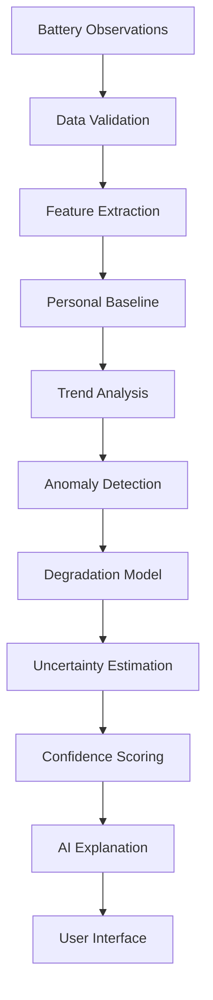

---

# 🧠 Predictive Data Model

```ts
export interface BatteryPrediction {
  predictedCondition: number;

  horizonDays: number | null;

  lowerBoundDays: number | null;

  upperBoundDays: number | null;

  confidence:
    | "low"
    | "medium"
    | "high";

  evidence: PredictionEvidence[];

  generatedAt: number;
}

export interface PredictionEvidence {
  metric:
    | "temperature"
    | "chargeRate"
    | "dischargeRate"
    | "cycleProxy"
    | "capacity"
    | "usage";

  contribution: number;

  direction:
    | "positive"
    | "negative"
    | "neutral";

  explanation: string;
}
```

---

# 🤖 AI Provider Architecture

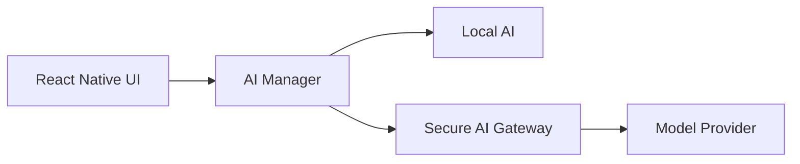

The client must never contain privileged model-provider API keys.

---

# 💬 AI Assistant

Users can ask:

```text
Why did my battery drop quickly?

How was my charging today?

Is my charging speed changing?

What patterns do you see?

Why is today's temperature higher?
```

Example answer:

```text
BatteryLens AI

Your battery discharged faster yesterday
than your recent baseline.

Available evidence shows:

• higher discharge rate
• longer period away from a charger
• no reliable app-level attribution

BatteryLens cannot determine the exact cause
from the available telemetry alone.
```

This evidence-first approach is central to the product.

---

# 📊 Explainable AI

Every important AI insight should be traceable to evidence.

```ts
export interface AIClaim {
  text: string;

  evidence: AIEvidence[];

  confidence:
    | "low"
    | "medium"
    | "high";
}

export interface AIEvidence {
  metric: string;

  value: number;

  unit: string;

  timestamp?: number;
}
```

UI:

```text
Why am I seeing this?

Temperature
31.2°C average

Historical baseline
29.8°C

Difference
+1.4°C

Confidence
Medium
```

---

# ⚡ Smart Charging

Smart Charging combines:

```text
Charging target
+
Charging speed
+
User schedule
+
Historical routine
+
Notification preferences
```

Architecture:

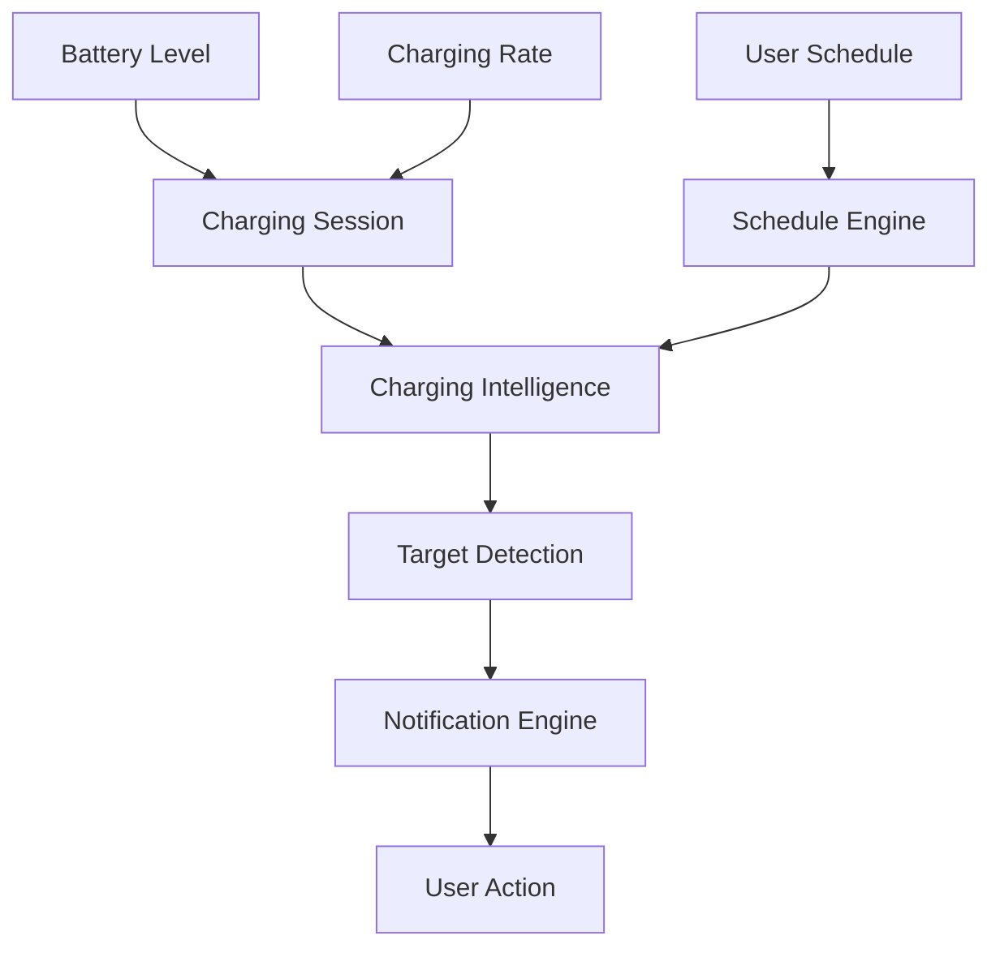

Example:

```text
Target:
80%

Typical completion:
7:42 AM

Current charging:
18.4 W

Estimated completion:
7:31 AM

Status:
On schedule
```

---

# 📅 Personalized Charging Schedules

BatteryLens can learn:

* typical charging start times
* typical charging completion times
* preferred target percentage
* weekday behavior
* weekend behavior

Example:

```text
Monday–Friday
Target: 80%
Completion: ~7:30 AM

Weekend
Target: 90%
Completion: ~10:00 AM
```

The system should only learn from sufficient historical data and clearly distinguish learned patterns from user-entered schedules.

---

# 🔔 Notification Architecture

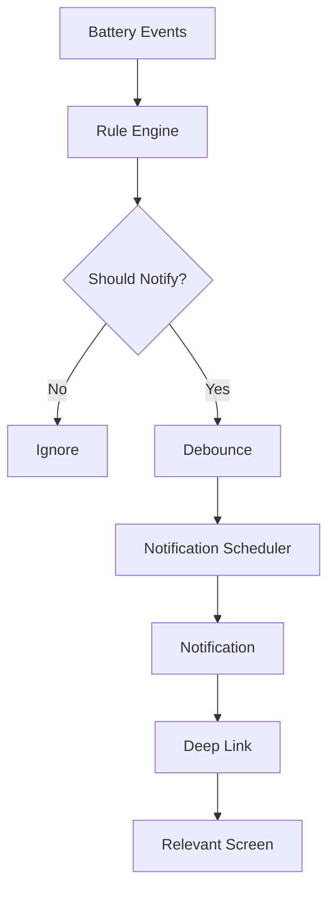

Notification states:

```text
scheduled
sent
cancelled
expired
suppressed
```

---

# 📱 Widget-First UX

BatteryLens is designed around the principle:

> **Open the app less. Understand more.**

The application should expose battery intelligence through:

* Home Screen widgets
* Lock Screen widgets
* Notifications
* Deep links
* Quick actions
* App shortcuts
* Connected-device dashboards

---

# 🧩 Widget Architecture

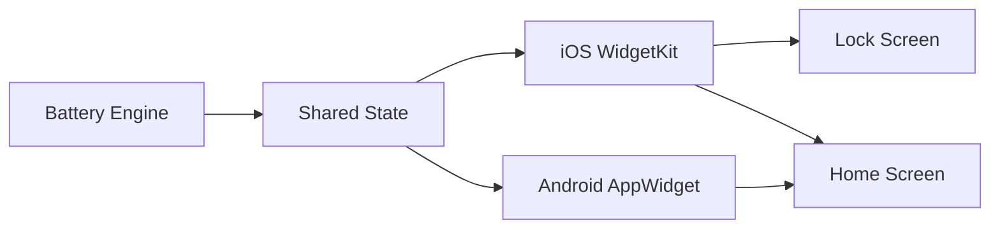

---

# 🟢 Compact Widget

```text
┌─────────────────────┐
│ Battery             │
│                     │
│       82%           │
│       ⚡ Charging   │
└─────────────────────┘
```

---

# 🔵 Medium Widget

```text
┌─────────────────────────────────┐
│ Battery                  82%    │
│                                 │
│ Charging                 18.4 W │
│ Target                    80%   │
│ ETA                       42m   │
└─────────────────────────────────┘
```

---

# 🟣 Large Widget

```text
┌────────────────────────────────────┐
│ BatteryLens                        │
│                                    │
│ 82%                                │
│ Charging                           │
│                                    │
│ Power             18.4 W           │
│ Temperature        31°C            │
│ Target              80%            │
│ ETA                 42 min         │
│                                    │
│ AI brief                           │
│ Charging is close to your normal   │
│ pattern.                           │
│                                    │
│ View insights →                    │
└────────────────────────────────────┘
```

---

# 🔗 Deep-Link Architecture

```text
batterylens://battery
batterylens://charging
batterylens://health
batterylens://insights
batterylens://devices
batterylens://fleet
```

React Native routing:

```ts
export function handleDeepLink(
  url: string
) {
  if (
    url.includes(
      "batterylens://charging"
    )
  ) {
    return "Charging";
  }

  if (
    url.includes(
      "batterylens://health"
    )
  ) {
    return "Health";
  }

  if (
    url.includes(
      "batterylens://fleet"
    )
  ) {
    return "Fleet";
  }

  return "Home";
}
```

---

# ⚫ OLED-Optimized Design

BatteryLens provides a true-black dark theme:

```ts
export const oledDarkTheme = {
  background: "#000000",
  surface: "#000000",
  text: "#FFFFFF",
  secondaryText: "#A1A1AA",
  border: "#1F1F23",
  accent: "#FFFFFF",
};
```

The design deliberately avoids:

```text
continuous gradients
persistent animations
large decorative video
unnecessary blur
excessive shadows
```

### Important

The application should not claim that this results in **zero power consumption**.

True black can reduce display power on compatible OLED/AMOLED screens, but total power consumption still depends on:

* display brightness
* refresh rate
* CPU activity
* GPU activity
* network radios
* sensors
* operating-system behavior
* device hardware

The product claim should therefore be:

> **OLED-optimized true-black interface designed to minimize unnecessary display energy on compatible screens.**

---

# 🧭 Zero-Configuration Setup

The core phone battery experience requires no Bluetooth configuration.

The desired flow is:

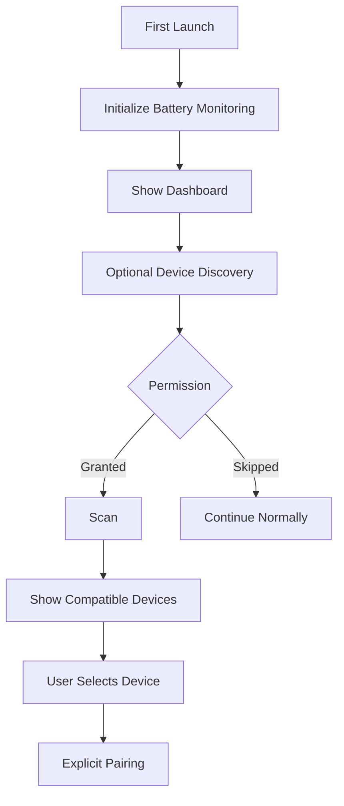

The application should never force unnecessary nearby-device permissions just to show the phone's own battery.

---

# 📡 Device Discovery

Supported architecture:

```text
Bluetooth
Wi-Fi
Home Assistant
HomeKit
Matter
Smart Plugs
Future device adapters
```

Common interface:

```ts
export interface EcosystemConnector {
  id: string;

  authenticate():
    Promise<void>;

  discover():
    Promise<EcosystemDevice[]>;

  read(
    deviceId: string
  ):
    Promise<EnergyObservation>;

  disconnect():
    Promise<void>;
}
```

---

# 🌐 Smart Ecosystem Sync

BatteryLens can act as an aggregation layer over supported integrations.

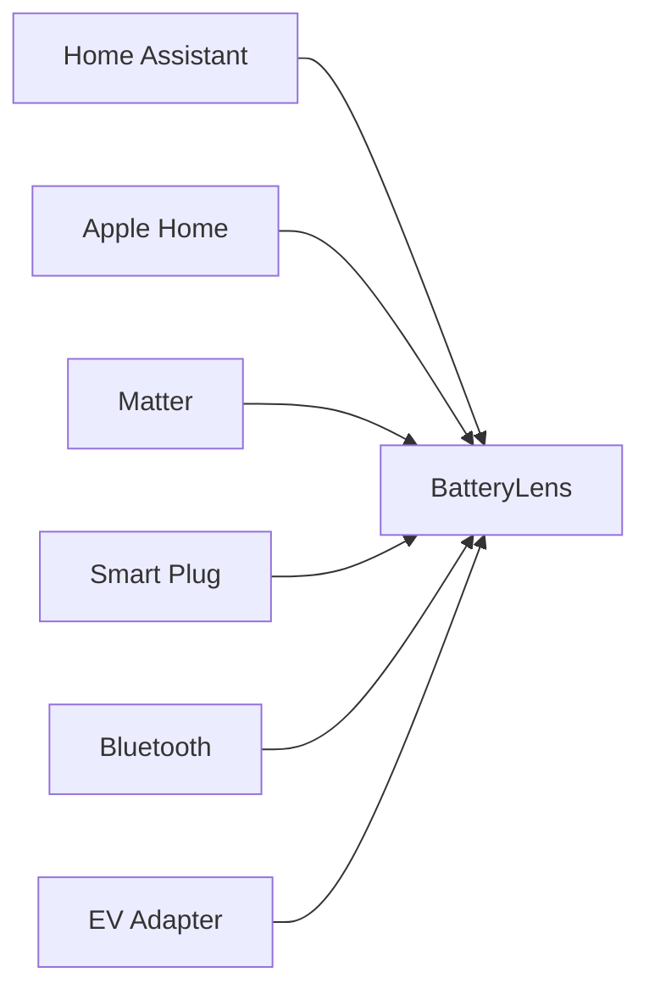

---

# 🏠 Home Assistant

Home Assistant integration uses an adapter around its documented API.

Conceptual architecture:

```text
BatteryLens
     │
     ▼
Home Assistant Connector
     │
     ▼
Home Assistant API
     │
     ├── Power sensors
     ├── Energy sensors
     ├── Battery entities
     ├── Temperature sensors
     └── Smart devices
```

Example:

```ts
export class HomeAssistantConnector
  implements EcosystemConnector {

  id = "homeassistant";

  constructor(
    private client:
      HomeAssistantClient
  ) {}

  async authenticate() {
    await this.client.request(
      "/api/"
    );
  }

  async discover() {
    const states =
      await this.client.request(
        "/api/states"
      );

    return mapHAStatesToDevices(
      states
    );
  }

  async read(
    deviceId: string
  ) {
    const state =
      await this.client.request(
        `/api/states/${deviceId}`
      );

    return mapHAStateToObservation(
      state
    );
  }

  async disconnect() {}
}
```

---

# 🏡 Apple Home / HomeKit

The iOS connector uses native HomeKit APIs.

```swift
import HomeKit

final class BatteryHomeManager:
    NSObject,
    HMHomeManagerDelegate {

    let manager =
        HMHomeManager()

    override init() {
        super.init()
        manager.delegate = self
    }

    func homeManagerDidUpdateHomes(
        _ manager: HMHomeManager
    ) {
        // Publish updated homes.
    }
}
```

BatteryLens should map supported services and characteristics into the common ecosystem model.

---

# 🔌 Smart Plug Integration

A smart plug becomes especially useful when paired with battery charging data.

```text
Phone battery
      +
Smart plug power
      ↓
Charging correlation
      ↓
Estimated wall energy
      ↓
Charging report
```

Example:

```text
Phone:
+31%

Smart plug:
0.12 kWh

Estimated charging energy:
0.12 kWh

BatteryLens:
Charging session appears normal.
```

Values should be clearly labeled as estimated where appropriate.

---

# 🚲 Multi-Device Support

Unified device abstraction:

```ts
export type EcosystemDeviceType =
  | "phone"
  | "tablet"
  | "laptop"
  | "ev"
  | "power-tool"
  | "smart-plug"
  | "charger"
  | "power-station"
  | "other";
```

Dashboard:

```text
┌──────────────────────────────────┐
│ My Devices                       │
├──────────────────────────────────┤
│ iPhone             82% Charging  │
│ Laptop             64% Battery   │
│ E-bike             71% Idle      │
│ Power Station      91% Ready     │
│ Smart Plug         18 W          │
└──────────────────────────────────┘
```

---

# 👨‍👩‍👧 Family Tracking

BatteryLens Family introduces shared visibility.

```text
Family
├── Dad's phone
├── Mom's phone
├── Tablet
├── Work phone
└── E-bike
```

Family dashboard:

```text
Family Battery

5 devices

Healthy              3
Charging             1
Low                  1
Offline               0
```

---

# 🏢 Fleet Tracking

BatteryLens Fleet is designed for small businesses.

Example:

```text
24 managed devices

17 healthy
4 charging
2 low
1 offline
```

Potential fleet devices:

* delivery phones
* tablets
* laptops
* e-bikes
* barcode scanners
* power stations
* supported EV integrations

---

# 🏭 Fleet Architecture

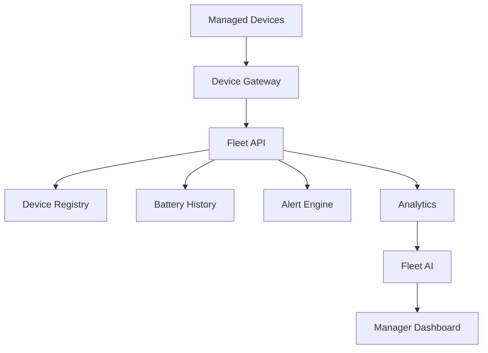

---

# 👥 Fleet Roles

```ts
export type BusinessRole =
  | "owner"
  | "admin"
  | "manager"
  | "operator"
  | "viewer";
```

Permission model:

```text
Owner
├── Billing
├── Members
├── Devices
├── Reports
└── Privacy

Admin
├── Members
├── Devices
├── Reports
└── Privacy

Manager
├── Devices
├── Alerts
└── Reports

Operator
├── View Fleet
└── Alerts

Viewer
└── View Fleet
```

---

# 🚨 Fleet Alerts

Example:

```text
⚠ Low Battery

Delivery Phone 07

Current:
13%

Assigned:
Driver 07

Last seen:
10 minutes ago
```

Another example:

```text
⚠ Offline Device

E-bike 14

Last report:
42 minutes ago
```

---

# 📈 Fleet AI

BatteryLens can generate aggregate insights.

```text
Fleet AI

Two devices show unusually low battery
levels relative to the fleet baseline.

Three devices have not reported recently.

Recommended action:
Review charging readiness before
the next operating period.
```

AI should avoid exposing unnecessary employee information.

---

# 🔐 Privacy Architecture

BatteryLens is designed around:

```text
LOCAL-FIRST
```

Architecture:

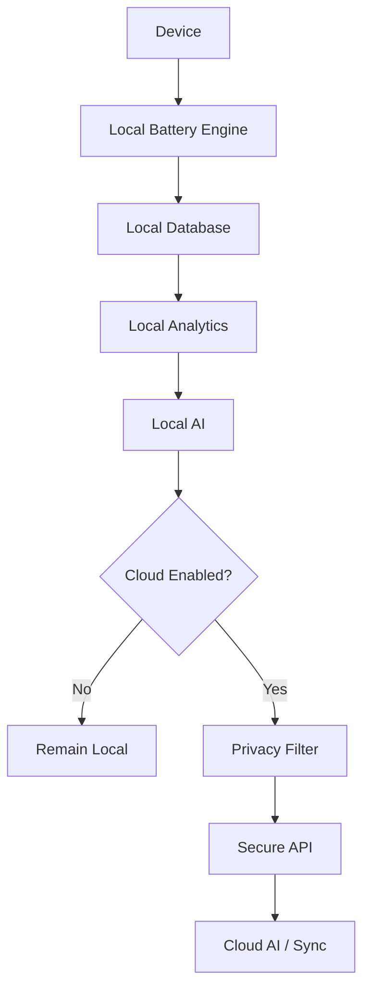

---

# 🛡 Privacy Principles

BatteryLens should follow these principles:

### 1. Local by default

Basic battery analytics should work without an account.

### 2. Cloud optional

Cloud AI and cloud sync require explicit opt-in.

### 3. Data minimization

Only send information needed for a specific cloud operation.

### 4. User control

Provide:

```text
Export data
Delete data
Disable cloud sync
Disable analytics
Disconnect integrations
```

### 5. Transparent sharing

Family/fleet users should know what information is shared.

---

# 🔒 Secure Storage

Sensitive credentials should use platform-secure storage.

```ts
export interface CredentialStore {
  save(
    namespace: string,
    value: string
  ): Promise<void>;

  get(
    namespace: string
  ): Promise<string | null>;

  remove(
    namespace: string
  ): Promise<void>;
}
```

Never store service credentials directly in normal application preferences.

---

# 💰 Monetization

BatteryLens uses a layered commercial model.

```text
FREE
   ↓
PRO
   ↓
FAMILY
   ↓
FLEET LIGHT
   ↓
FLEET BUSINESS
```

---

# 🆓 Free

The free product should remain useful.

```text
✓ Single-device monitoring
✓ Battery percentage
✓ Charging state
✓ Basic sessions
✓ Basic alerts
✓ Basic local insights
✓ Basic widget
✓ Dark mode
```

---

# ⭐ Pro

```text
✓ Advanced history
✓ Predictive analytics
✓ Advanced AI
✓ Battery assistant
✓ Multi-device
✓ Supported EV integrations
✓ Ecosystem integrations
✓ Advanced reports
✓ Exports
✓ Ad-free experience
```

---

# 👨‍👩‍👧 Family

```text
✓ Shared devices
✓ Household dashboard
✓ Family alerts
✓ Multiple members
✓ Permission controls
✓ Shared battery reports
```

---

# 🚚 Fleet Light

Designed for small organizations.

```text
✓ Small fleet management
✓ Device dashboard
✓ Low-battery alerts
✓ Offline alerts
✓ Fleet reports
✓ Device assignments
✓ Team permissions
```

---

# 🏢 Fleet Business

```text
✓ Larger fleet limits
✓ Advanced analytics
✓ Fleet AI
✓ Device management
✓ Custom retention
✓ Ecosystem integrations
✓ Advanced reporting
✓ Organization controls
```

---

# 💎 Lifetime Unlock

A lifetime purchase can cover eligible local Pro functionality.

Important architectural distinction:

```text
Lifetime
=
eligible local software features

Subscription
=
ongoing cloud services
+
cloud AI
+
cloud storage
+
fleet infrastructure
```

This prevents the business model from making indefinite cloud costs dependent on a one-time payment.

---

# 💵 Entitlement Architecture

```ts
export interface BusinessEntitlements {
  maxPersonalDevices: number;

  maxFamilyDevices: number;

  maxFleetDevices: number;

  advancedHistory: boolean;

  predictiveAI: boolean;

  multiDeviceAnalytics: boolean;

  evIntegration: boolean;

  ecosystemSync: boolean;

  familyDashboard: boolean;

  fleetDashboard: boolean;

  fleetAlerts: boolean;

  fleetReports: boolean;

  cloudSync: boolean;

  exports: boolean;

  adsRemoved: boolean;
}
```

---

# 🧱 Data Architecture

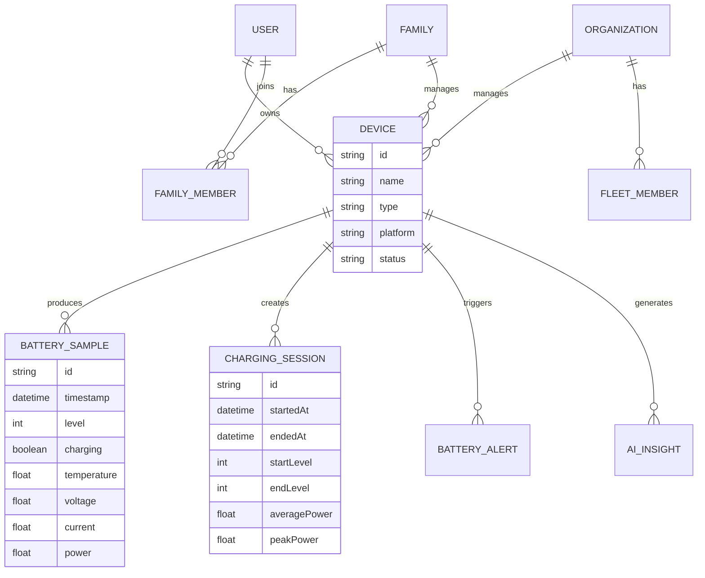

---

# 🗃 Database Structure

Recommended tables:

```text
users
devices
battery_samples
charging_sessions
discharge_sessions
daily_summaries
battery_predictions
ai_insights
ai_feedback
notification_settings
notification_history
ecosystem_connections
family_members
organizations
fleet_members
device_assignments
fleet_alerts
subscriptions
entitlements
sync_queue
audit_logs
```

---

# 🔌 Domain Interfaces

```ts
export interface BatteryRepository {
  saveReading(
    reading: BatteryReading
  ): Promise<void>;

  getReadings(
    from: number,
    to: number
  ): Promise<BatteryReading[]>;

  getLatest():
    Promise<BatteryReading | null>;
}
```

---

# 🧠 Service Architecture

```text
UI
│
├── BatteryService
├── SessionService
├── HealthEngine
├── PredictiveHealthEngine
├── AIManager
├── NotificationService
├── EcosystemSync
├── FamilyService
├── FleetService
└── MonetizationService
│
▼
Repositories
│
├── BatteryRepository
├── SessionRepository
├── DeviceRepository
├── AIRepository
└── EntitlementRepository
│
▼
Infrastructure
│
├── SQLite
├── Native Modules
├── Secure Storage
├── HTTP API
└── Platform Billing
```

---

# 📁 Project Structure

```text
BatteryLens/
│
├── android/
│
├── ios/
│
├── src/
│   │
│   ├── ai/
│   │   ├── local/
│   │   ├── cloud/
│   │   ├── anomaly/
│   │   ├── prediction/
│   │   ├── insights/
│   │   ├── prompts/
│   │   └── privacy/
│   │
│   ├── battery/
│   │   ├── BatteryService.ts
│   │   ├── BatteryProvider.tsx
│   │   └── calculations.ts
│   │
│   ├── smartCharging/
│   │   ├── targets.ts
│   │   ├── schedules.ts
│   │   ├── reminders.ts
│   │   └── optimizer.ts
│   │
│   ├── ecosystem/
│   │   ├── registry.ts
│   │   ├── homeassistant/
│   │   ├── homekit/
│   │   ├── matter/
│   │   ├── bluetooth/
│   │   └── smartPlugs/
│   │
│   ├── fleet/
│   │   ├── devices/
│   │   ├── alerts/
│   │   ├── members/
│   │   ├── reports/
│   │   └── analytics/
│   │
│   ├── monetization/
│   │   ├── plans/
│   │   ├── entitlements/
│   │   ├── purchases/
│   │   ├── subscriptions/
│   │   ├── lifetime/
│   │   └── paywall/
│   │
│   ├── widgets/
│   │
│   ├── notifications/
│   │
│   ├── database/
│   │   ├── migrations/
│   │   ├── repositories/
│   │   └── schema/
│   │
│   ├── components/
│   │
│   ├── screens/
│   │
│   ├── navigation/
│   │
│   ├── store/
│   │
│   ├── theme/
│   │
│   └── utils/
│
├── package.json
├── tsconfig.json
├── README.md
└── .env.example
```

---

# 🛠 Installation

Clone the repository:

```bash
git clone https://github.com/YOUR_USERNAME/batterylens.git

cd batterylens
```

Install dependencies:

```bash
npm install
```

or:

```bash
yarn install
```

---

# ▶️ Run the Application

Start Metro:

```bash
npm start
```

Android:

```bash
npm run android
```

iOS:

```bash
npm run ios
```

---

# 🧪 TypeScript Validation

```bash
npx tsc --noEmit
```

Expected:

```text
Found 0 errors.
```

---

# 🧹 Lint

```bash
npm run lint
```

---

# 🧪 Tests

Run:

```bash
npm test
```

or:

```bash
npm test -- --runInBand
```

---

# 📱 Native Testing

BatteryLens requires physical-device testing for many battery behaviors.

Test:

```text
Android
├── charging
├── unplugging
├── temperature
├── voltage
├── current
└── widget updates

iOS
├── battery level
├── charging state
├── widget timeline
├── Lock Screen widget
└── deep links
```

---

# 🧪 Mock Battery Provider

Development builds should include:

```ts
export class MockBatteryProvider
  implements BatteryProvider {

  async getSnapshot() {
    return {
      level: 78,
      charging: true,
      status: "charging",
      temperature: 31,
      voltage: 4.2,
      current: 2200,
      power: 9.24,
      timestamp:
        Date.now(),
    };
  }

  subscribe(callback) {
    return () => {};
  }
}
```

Scenarios:

```text
normal
charging
low battery
full
hot device
unknown metrics
offline ecosystem
```

---

# 🔧 Environment Configuration

Create:

```bash
cp .env.example .env
```

Example:

```env
APP_ENV=development

API_URL=http://localhost:3000

CLOUD_SYNC_ENABLED=false

CLOUD_AI_ENABLED=false

ANALYTICS_ENABLED=false

ADS_ENABLED=false
```

Never commit production secrets.

---

# 🤖 Secure AI Gateway

Production AI architecture:

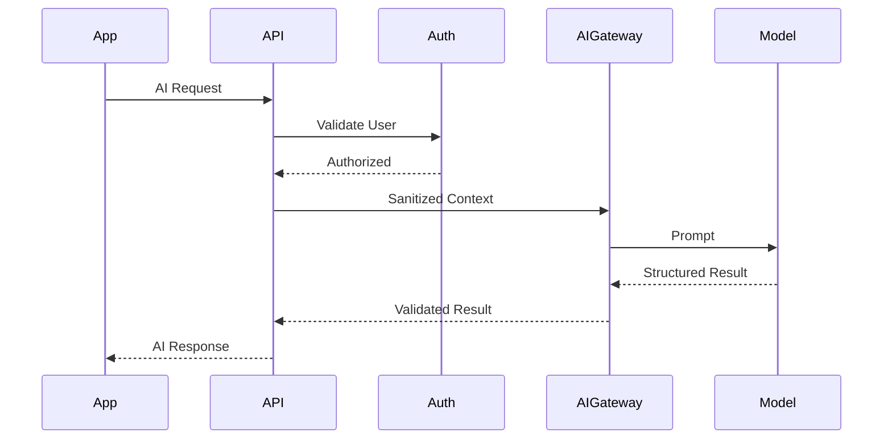

The mobile application should never contain privileged AI provider credentials.

---

# 🔐 Security

Security principles:

```text
No hardcoded secrets
No privileged API keys in mobile bundle
Parameterized database queries
Secure token storage
HTTPS for cloud services
Server-side entitlement validation
Role-based fleet access
Minimal telemetry
Explicit cloud consent
Deletion controls
Audit logs
```

---

# 🧑‍💻 Permissions

BatteryLens should avoid asking for unrelated permissions.

Core battery functionality:

```text
Battery API
```

Optional ecosystem features may require:

```text
Bluetooth
Nearby devices
Wi-Fi
HomeKit
Notification
```

Permission flow:

```text
Explain
↓
Ask
↓
User decides
↓
Feature continues or gracefully degrades
```

Do not require Bluetooth to show the user's phone battery percentage.

---

# 📶 Offline-First Architecture

Core functionality should work offline:

```text
Battery monitoring
Charging sessions
History
Local AI
Basic alerts
Widgets
Basic reports
```

Cloud is optional.

When network connectivity is unavailable:

```ts
if (!isOnline()) {
  return localAI.analyze(
    input
  );
}
```

---

# ⚡ Performance

BatteryLens itself must avoid becoming a battery-draining application.

Avoid:

```text
1-second polling
continuous background JavaScript
infinite animations
constant Bluetooth scanning
large database writes every second
unnecessary network requests
```

Prefer:

```text
OS events
adaptive sampling
batched writes
local caching
widget refresh throttling
event-driven monitoring
```

---

# 📉 Sampling Strategy

Example:

```text
Foreground:
15–30 seconds

Charging:
adaptive

Background:
OS-supported events

Significant event:
immediate sample
```

The exact strategy should depend on platform capabilities.

---

# 🧠 Battery Self-Monitoring

BatteryLens can measure its own monitoring overhead during development.

```ts
export interface MonitoringDiagnostics {
  batteryEvents: number;

  databaseWrites: number;

  widgetUpdates: number;

  discoveryScans: number;

  activeTimers: number;
}
```

Development dashboard:

```text
BatteryLens Diagnostics

Battery events       184
Database writes       21
Widget updates         4
Discovery scans        1
Active timers          0
```

---

# 📊 Observability

Production telemetry should focus on system health.

Track:

```text
app startup
native-module errors
database failures
notification failures
billing failures
AI latency
AI failure rate
ecosystem sync errors
fleet synchronization errors
```

Avoid collecting detailed battery history merely for analytics.

---

# 📈 Product Analytics

Useful events:

```text
battery_dashboard_viewed
charging_session_created
smart_target_enabled
widget_opened
ai_insight_viewed
ai_question_asked
paywall_viewed
purchase_started
purchase_completed
fleet_created
device_added
fleet_alert_resolved
```

Do not automatically transmit complete battery histories as analytics events.

---

# 🧪 AI Evaluation

Create an evaluation suite.

```ts
export interface AIEvaluationCase {
  input: AIInput;

  expectedProperties: {
    doesNotInventMetrics: boolean;
    identifiesEstimates: boolean;
    citesEvidence: boolean;
    confidenceShown: boolean;
  };
}
```

Example:

```ts
describe(
  "Battery AI",
  () => {

    it(
      "does not invent temperature",
      async () => {

        const result =
          await localAI.analyze({
            task: "analyze",
            observations: [],
            features: {
              averageLevel: 72,
              chargingSessions: 4,
              rapidDischargeEvents: 0,
            },
          });

        expect(
          result.text
        ).not.toContain(
          "31°C"
        );
      }
    );

  }
);
```

---

# 🧪 Fleet Testing

Test:

```text
1 device
5 devices
25 devices
100 devices
offline device
duplicate device
retired device
unauthorized viewer
expired invitation
expired subscription
```

---

# 🧪 Permission Testing

Test:

```text
permission granted
permission denied
permission revoked
permission unavailable
```

The application should never become unusable simply because optional ecosystem permission was denied.

---

# 🧪 Widget Testing

Verify:

```text
battery level displayed
charging status displayed
missing power handled
stale data handled
deep link works
privacy settings respected
dark mode works
widget refresh throttled
```

---

# 🧪 Smart Charging Testing

Test:

```text
target 80%
target 90%
target 100%
target reached
target already reached
duplicate notification
schedule crossing midnight
weekend schedule
no charging-rate data
charging interrupted
```

---

# 🔁 CI/CD

Suggested GitHub Actions pipeline:

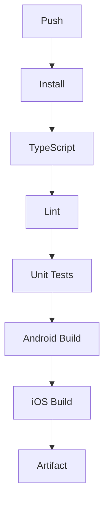

Example:

```yaml
name: BatteryLens CI

on:
  push:
    branches:
      - main

  pull_request:

jobs:
  validate:
    runs-on: ubuntu-latest

    steps:
      - uses:
          actions/checkout@v4

      - uses:
          actions/setup-node@v4
        with:
          node-version: 20

      - run:
          npm ci

      - run:
          npx tsc --noEmit

      - run:
          npm run lint

      - run:
          npm test -- --runInBand
```

Native build jobs can be added separately for Android and iOS.

---

# 🗺 Roadmap

## Phase 1 — Foundation

```text
✓ Battery monitoring
✓ Local database
✓ Charging sessions
✓ Basic alerts
✓ Dark mode
✓ Widgets
```

## Phase 2 — Intelligence

```text
✓ Personal baselines
✓ Anomaly detection
✓ AI insights
✓ Predictive analytics
✓ Battery assistant
✓ Smart charging
```

## Phase 3 — Ecosystem

```text
□ Home Assistant
□ HomeKit
□ Matter
□ Smart plugs
□ Multi-device
□ E-bike adapters
□ EV adapters
```

## Phase 4 — Family

```text
□ Household accounts
□ Shared devices
□ Shared alerts
□ Family reports
```

## Phase 5 — Business

```text
□ Fleet Light
□ Fleet Business
□ Device assignments
□ Team permissions
□ Fleet AI
□ Operational reports
```

---

# 🏗 Future Architecture

The long-term system is designed to evolve into:

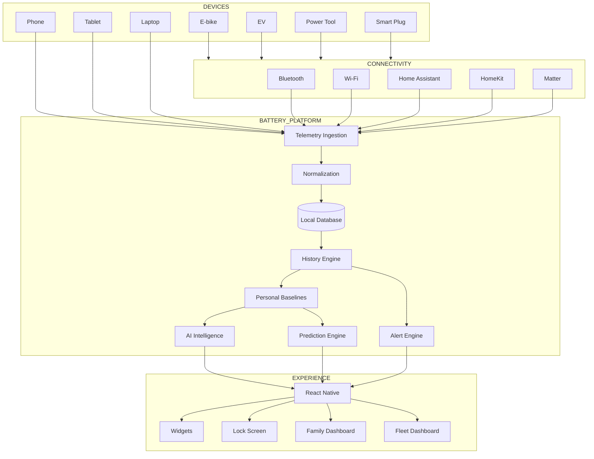

---

# 🧩 Design Philosophy

BatteryLens follows several architectural principles.

## Local First

Core functionality should not require an account.

## Capability First

Features adapt to what the device actually exposes.

## Evidence First

AI claims should be grounded in measurable or derived data.

## Privacy First

Cloud processing should be optional where practical.

## Event Driven

Prefer OS events over constant polling.

## Modular

Every major integration should be an adapter.

## Explainable

Users should understand why BatteryLens generated an insight.

## Non-Intrusive Monetization

The free product should remain genuinely useful.

---

# 🧠 The Product Moat

BatteryLens aims to become more valuable over time because the application accumulates a personalized understanding of:

```text
charging patterns
discharge patterns
temperature behavior
device history
user schedules
device ecosystem
fleet behavior
AI feedback
```

This creates a loop:

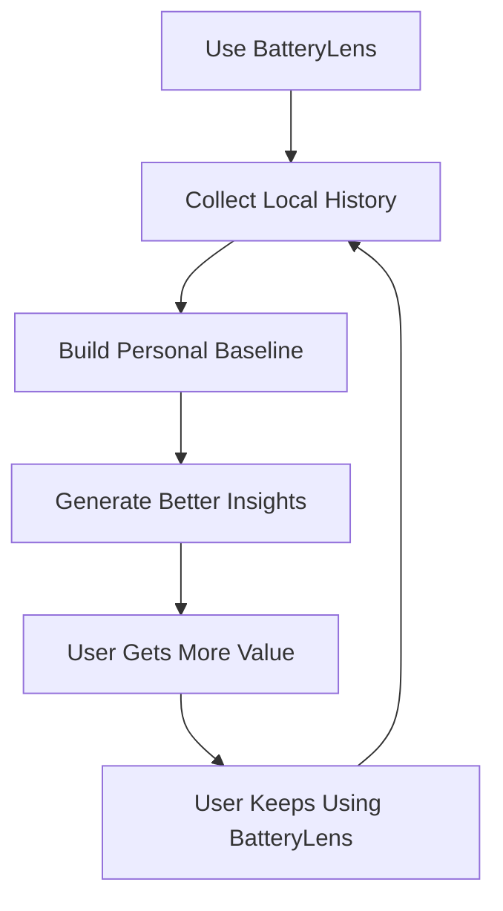

The result is a product that becomes increasingly personalized rather than simply increasing the number of displayed metrics.

---

# 💼 Business Model

BatteryLens is designed around several monetization layers.

```text
                BATTERYLENS
                     │
       ┌─────────────┼─────────────┐
       │             │             │
     Consumer      Family       Business
       │             │             │
      Free        Family        Fleet Light
       │                         Fleet Business
      Pro
       │
    Lifetime
```

### Consumer

Recurring revenue from:

* Pro subscriptions
* AI features
* cloud synchronization
* advanced analytics

### Family

Recurring revenue from:

* shared device management
* alerts
* household dashboards

### Business

Recurring revenue from:

* fleet monitoring
* device management
* reports
* AI
* operational visibility

---

# 🧱 Recommended Technology Stack

## Mobile

```text
React Native
TypeScript
React Navigation
Zustand
Reanimated
Gesture Handler
SVG rendering
SQLite/local persistence
Native modules
```

## Android

```text
Kotlin
BatteryManager
BroadcastReceiver
AppWidgetProvider
Android notifications
Nearby-device APIs
```

## iOS

```text
Swift
UIKit
WidgetKit
HomeKit
App Intents
StoreKit
App Groups
```

## Backend

Optional:

```text
Node.js / NestJS
or
Python / FastAPI
```

Supporting infrastructure:

```text
PostgreSQL
Redis
Object Storage
HTTPS API
Secure authentication
```

---

# 🔌 API Architecture

```text
/v1/auth
/v1/devices
/v1/battery
/v1/charging
/v1/insights
/v1/predictions
/v1/ai
/v1/ecosystem
/v1/family
/v1/fleet
/v1/entitlements
/v1/subscriptions
/v1/reports
```

Example:

```http
GET /v1/devices
```

```json
{
  "devices": [
    {
      "id": "device_001",
      "name": "Work Phone",
      "type": "phone",
      "batteryLevel": 82,
      "charging": true
    }
  ]
}
```

---

# 🏢 Fleet API Example

```http
GET /v1/fleet/summary
```

Response:

```json
{
  "totalDevices": 24,
  "onlineDevices": 23,
  "chargingDevices": 4,
  "lowBatteryDevices": 2,
  "offlineDevices": 1
}
```

---

# 🔐 Entitlement API

```http
GET /v1/entitlements
```

```json
{
  "plan": "fleet-light",
  "features": {
    "fleetDashboard": true,
    "fleetAlerts": true,
    "fleetReports": true,
    "predictiveAI": true
  }
}
```

The server remains authoritative for server-managed capabilities.

---

# 📦 Example Battery Event

```json
{
  "deviceId": "phone_001",
  "timestamp": "2026-08-27T19:30:00Z",
  "level": 82,
  "charging": true,
  "temperature": 31.2,
  "voltage": 4.2,
  "current": 2.1
}
```

Derived power:

```text
4.2 V × 2.1 A ≈ 8.82 W
```

Derived values should be labeled accordingly.

---

# 🧭 User Experience Principles

BatteryLens should optimize for:

### Glanceability

Users should understand the main state immediately.

### Progressive Disclosure

Show:

```text
Simple
↓
Useful
↓
Detailed
↓
Advanced
```

### Zero Friction

The user should reach useful battery information quickly.

### Trust

Never invent a battery measurement.

### Control

Users decide whether to:

* share data
* enable cloud features
* connect devices
* join a family
* join a fleet
* subscribe

---

# 📱 Final Home Screen Concept

```text
┌──────────────────────────────────────────┐
│ BatteryLens                              │
│                                          │
│ Battery                                  │
│                                          │
│                  82%                     │
│               Charging                   │
│                                          │
│  18.4 W        31°C        42 min        │
│  Power         Temp        ETA            │
│                                          │
│ ──────────────────────────────────────── │
│                                          │
│ AI Battery Brief                         │
│                                          │
│ Your charging pattern looks close        │
│ to your recent baseline.                 │
│                                          │
│ Confidence: Medium                       │
│                                          │
│ [View Insights]                          │
│                                          │
│ ──────────────────────────────────────── │
│                                          │
│ Smart Charging                           │
│ Target: 80%                              │
│ Typical completion: 7:42 AM              │
│                                          │
└──────────────────────────────────────────┘
```

---

# 🌎 Ecosystem Dashboard Concept

```text
┌────────────────────────────────────────────┐
│ Energy & Battery                           │
├────────────────────────────────────────────┤
│                                            │
│ PHONE                   82% ⚡              │
│ Charging                 18.4 W            │
│                                            │
│ LAPTOP                  64%                │
│ On battery                                 │
│                                            │
│ E-BIKE                  71%                │
│ Ready                                      │
│                                            │
│ POWER STATION            91%               │
│ Idle                                        │
│                                            │
│ SMART PLUG               18 W              │
│                                            │
│ ────────────────────────────────────────── │
│ AI Ecosystem Brief                         │
│ 2 devices are currently charging.         │
│                                            │
└────────────────────────────────────────────┘
```

---

# 🚚 Fleet Dashboard Concept

```text
┌────────────────────────────────────────────┐
│ BatteryLens Fleet                          │
├────────────────────────────────────────────┤
│                                            │
│ 24 Devices                                 │
│                                            │
│ Healthy          17                       │
│ Charging          4                       │
│ Low               2                       │
│ Offline            1                      │
│                                            │
│ ────────────────────────────────────────── │
│ Attention Required                         │
│                                            │
│ Work Phone 07       13%        ⚠          │
│ E-bike 14           Offline    ⚠          │
│                                            │
│ [Open Fleet]                              │
└────────────────────────────────────────────┘
```

---

# 📚 Documentation Structure

Recommended future documentation:

```text
docs/
├── architecture/
│   ├── overview.md
│   ├── battery-engine.md
│   ├── ai-engine.md
│   ├── ecosystem.md
│   └── fleet.md
│
├── platform/
│   ├── android.md
│   ├── ios.md
│   ├── widgets.md
│   └── permissions.md
│
├── security/
│   ├── threat-model.md
│   ├── privacy.md
│   └── data-retention.md
│
├── business/
│   ├── pricing.md
│   ├── entitlements.md
│   └── fleet-billing.md
│
└── development/
    ├── setup.md
    ├── testing.md
    └── release.md
```

---

# 🧑‍💻 Contributing

Contributions are welcome.

## Development process

```text
Fork
↓
Create branch
↓
Implement change
↓
Write tests
↓
Run validation
↓
Open Pull Request
```

Recommended branch format:

```text
feature/widget-lockscreen
feature/homeassistant
feature/fleet-alerts
feature/predictive-ai
fix/battery-session
```

---

# ✅ Pull Request Checklist

Before submitting:

```text
[ ] TypeScript passes
[ ] Lint passes
[ ] Unit tests pass
[ ] No secrets committed
[ ] Platform limitations documented
[ ] Accessibility considered
[ ] Offline behavior considered
[ ] Privacy impact considered
[ ] Battery overhead considered
[ ] Error states implemented
[ ] Unsupported metrics handled
```

---

# 🧪 Quality Standards

A BatteryLens feature should not be considered complete until it has:

```text
UI
+
Domain Logic
+
Error Handling
+
Empty State
+
Loading State
+
Unavailable State
+
Testing
+
Accessibility
+
Privacy Review
+
Performance Review
```

---

# 🚦 Definition of Done

A production feature must satisfy:

```text
Functional
✓

Tested
✓

Accessible
✓

Offline-safe
✓

Privacy-reviewed
✓

Platform-aware
✓

Battery-conscious
✓

Observable
✓
```

---

# 🛡 Platform Capability Philosophy

BatteryLens must always distinguish:

```text
MEASURED
↓
Directly exposed by device/API

CALCULATED
↓
Derived mathematically

ESTIMATED
↓
Generated from a model/heuristic

AI-GENERATED
↓
Natural-language interpretation

UNAVAILABLE
↓
Not exposed by platform/device
```

Example:

```text
Battery
82%
MEASURED

Charging power
18.4 W
CALCULATED

ETA
42 min
ESTIMATED

Battery condition
Good
HEURISTIC / AI ESTIMATE

Manufacturer battery health
UNAVAILABLE
```

This distinction is foundational to the project's trust model.

---

# 🚫 What BatteryLens Does Not Claim

BatteryLens does not automatically claim:

```text
exact battery lifespan
exact battery replacement date
exact battery health percentage
hardware-level charging control
unsupported device measurements
perfect EV interoperability
universal compatibility with every accessory
```

The platform should prefer transparent uncertainty to false precision.

---

# 🌟 Long-Term Vision

BatteryLens can eventually become an intelligent energy-awareness platform.

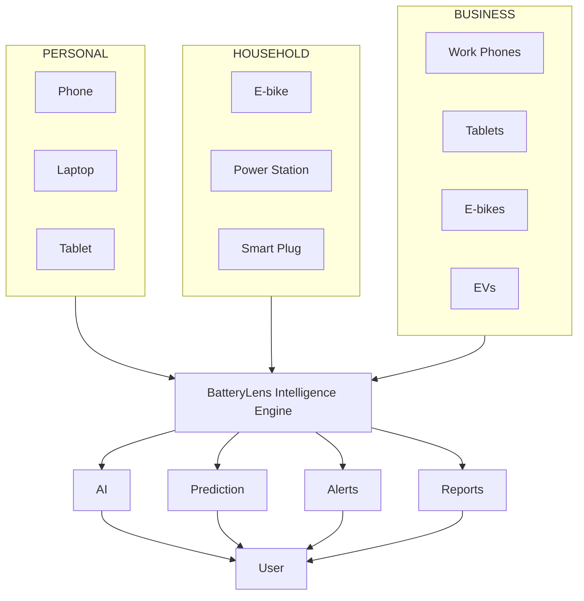

---

# 🔋 BatteryLens in One Diagram

```text
                                      ┌─────────────────┐
                                      │   BATTERYLENS   │
                                      └────────┬────────┘
                                               │
                    ┌──────────────────────────┼──────────────────────────┐
                    │                          │                          │
                    ▼                          ▼                          ▼
              MONITOR                    UNDERSTAND                    ACT
                    │                          │                          │
             Battery level                 AI insights                Alerts
             Charging                     Baselines                  Schedules
             Temperature                  Trends                     Widgets
             Power                        Anomalies                  Automation
             Voltage                      Prediction
             Current
                    │                          │                          │
                    └──────────────────────────┼──────────────────────────┘
                                               │
                                               ▼
                                      PERSONAL HISTORY
                                               │
                                               ▼
                                     CONNECTED ECOSYSTEM
                                               │
                    ┌──────────────────────────┼──────────────────────────┐
                    │                          │                          │
                 PERSONAL                   FAMILY                    BUSINESS
                    │                          │                          │
                 1 device                  Household                  Fleet
                    │                      Dashboard                  Dashboard
                    │                      Shared Alerts              Team Roles
                    │                      Multiple Devices            Reports
                    │                          │                          │
                    └──────────────────────────┼──────────────────────────┘
                                               │
                                               ▼
                                         MONETIZATION
                                               │
                           ┌───────────────────┼───────────────────┐
                           │                   │                   │
                         FREE                PRO               BUSINESS
                           │                   │                   │
                      Core utility       Advanced AI        Fleet features
                      Basic widgets      Prediction          Organizations
                      Basic alerts       Ecosystem           Reports
```

---

# 📌 Current Project Status

The project architecture is intended to support:

```text
✅ React Native mobile application
✅ Android battery integration
✅ iOS battery integration
✅ Charging sessions
✅ Battery history
✅ Smart charging alerts
✅ Personalized schedules
✅ AI insights
✅ Predictive health modeling
✅ Explainable AI
✅ Widgets
✅ Lock Screen surfaces
✅ OLED dark mode
✅ Optional device discovery
✅ Home Assistant architecture
✅ HomeKit architecture
✅ Matter architecture
✅ Smart plug architecture
✅ Multi-device dashboard
✅ Family tracking
✅ Fleet tracking
✅ Fleet permissions
✅ Subscription architecture
✅ Lifetime Pro architecture
✅ Privacy-first architecture
✅ Offline-first core functionality
```

Some integrations require platform-specific native implementation, external service authorization, or manufacturer-specific adapters.

---

# 🧭 Next Engineering Priorities

Recommended implementation order:

```text
1. Stabilize core battery engine
2. Stabilize local database
3. Complete widgets
4. Complete smart charging
5. Complete local AI
6. Complete predictive models
7. Complete secure entitlement infrastructure
8. Complete Home Assistant integration
9. Complete HomeKit integration
10. Complete multi-device platform
11. Complete Family
12. Complete Fleet Light
13. Complete Fleet Business
14. Harden security
15. Performance optimization
16. Production deployment
```

---

# 📄 License

Add the project's chosen license here.

Example:

```text
MIT License
```

or:

```text
Apache License 2.0
```

Choose the license deliberately based on whether commercial reuse, patent terms, and modification rights are important to the project.

---

# 🙌 Contributing & Community

BatteryLens is intended to evolve through contributions around:

```text
battery intelligence
mobile systems
AI
energy analytics
smart homes
device ecosystems
privacy engineering
fleet management
React Native
native Android
native iOS
```

Pull requests, issue reports, architecture discussions, and platform-specific improvements are encouraged.

---

# 🔋 BatteryLens

### **Your battery is more than a percentage.**

BatteryLens turns battery telemetry into:

```text
UNDERSTANDING
      +
CONTEXT
      +
PREDICTION
      +
ACTION
```

From:

```text
one phone
```

to:

```text
an entire household
```

to:

```text
a fleet of work devices
```

BatteryLens is designed to become the intelligence layer that helps people understand and manage the battery-powered devices they depend on every day.

---

## ⭐ Core Principle

```text
Measure honestly.
Explain clearly.
Predict cautiously.
Respect privacy.
Make the free product useful.
Make premium features genuinely valuable.
```

---

## 📬 Project Links

Replace these placeholders with the actual project URLs:

```text
GitHub:
https://github.com/YOUR_USERNAME/batterylens

Documentation:
https://github.com/YOUR_USERNAME/batterylens/tree/main/docs

Issues:
https://github.com/YOUR_USERNAME/batterylens/issues

Releases:
https://github.com/YOUR_USERNAME/batterylens/releases
```

---

# 🔋 BatteryLens

> **Monitor less. Understand more.**
